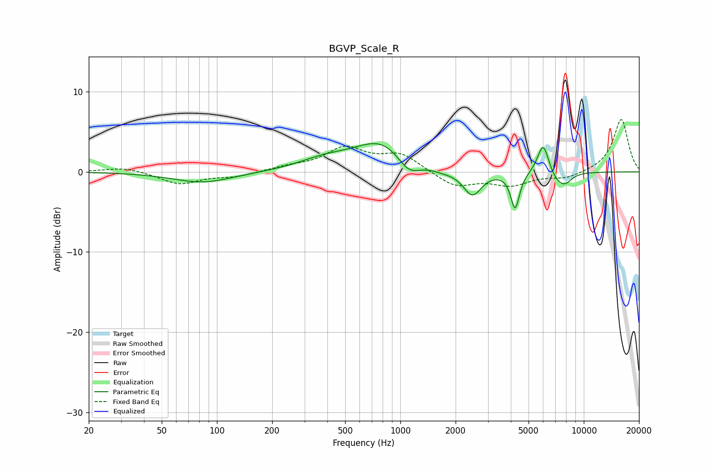

# BGVP_Scale_R
See [usage instructions](https://github.com/jaakkopasanen/AutoEq#usage) for more options and info.

### Parametric EQs
Apply preamp of -3.6 dB when using parametric equalizer.

|   # | Type    |   Fc (Hz) |    Q |   Gain (dB) |
|-----|---------|-----------|------|-------------|
|   1 | Peaking |        84 | 0.87 |        -1.4 |
|   2 | Peaking |       387 | 0.99 |         1.2 |
|   3 | Peaking |       797 | 0.95 |         3.7 |
|   4 | Peaking |      1110 | 2.23 |        -2.2 |
|   5 | Peaking |      1700 | 2.12 |        -0.4 |
|   6 | Peaking |      2468 | 2.85 |        -3.1 |
|   7 | Peaking |      4223 | 5.91 |        -4.6 |
|   8 | Peaking |      6008 | 4.43 |         3.9 |
|   9 | Peaking |      7239 | 2.79 |        -1.3 |
|  10 | Peaking |      7976 | 3.84 |        -0.9 |

### Fixed Band EQs
When using fixed band (also called graphic) equalizer, apply preamp of **-6.6 dB** (if available) and set gains manually with these parameters.

|   # | Type    |   Fc (Hz) |    Q |   Gain (dB) |
|-----|---------|-----------|------|-------------|
|   1 | Peaking |        31 | 1.41 |         0.6 |
|   2 | Peaking |        62 | 1.41 |        -1.5 |
|   3 | Peaking |       125 | 1.41 |        -0.6 |
|   4 | Peaking |       250 | 1.41 |         0.5 |
|   5 | Peaking |       500 | 1.41 |         2.8 |
|   6 | Peaking |      1000 | 1.41 |         2.1 |
|   7 | Peaking |      2000 | 1.41 |        -1.9 |
|   8 | Peaking |      4000 | 1.41 |        -1.5 |
|   9 | Peaking |      8000 | 1.41 |        -0.8 |
|  10 | Peaking |     16000 | 1.41 |         6.6 |

### Graphs

