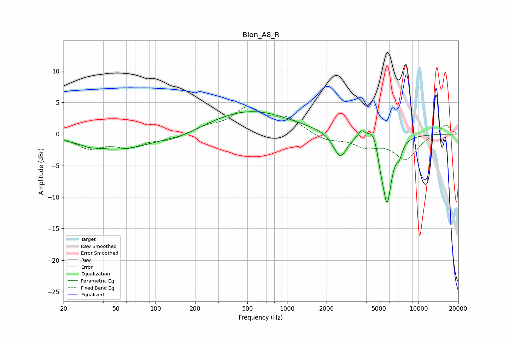

# Blon_A8_R
See [usage instructions](https://github.com/jaakkopasanen/AutoEq#usage) for more options and info.

### Parametric EQs
Apply preamp of -3.6 dB when using parametric equalizer.

|   # | Type    |   Fc (Hz) |    Q |   Gain (dB) |
|-----|---------|-----------|------|-------------|
|   1 | Peaking |        31 | 2.67 |        -0.3 |
|   2 | Peaking |        52 | 0.53 |        -2.5 |
|   3 | Peaking |       161 | 1.16 |        -0.7 |
|   4 | Peaking |       527 | 0.46 |         3.7 |
|   5 | Peaking |      2535 | 2.74 |        -4   |
|   6 | Peaking |      3665 | 6    |         1.1 |
|   7 | Peaking |      4549 | 3.19 |         2.3 |
|   8 | Peaking |      5137 | 6    |        -1.8 |
|   9 | Peaking |      5762 | 3.73 |       -10.7 |
|  10 | Peaking |      7161 | 5.83 |        -1.7 |

### Fixed Band EQs
When using fixed band (also called graphic) equalizer, apply preamp of **-4.4 dB** (if available) and set gains manually with these parameters.

|   # | Type    |   Fc (Hz) |    Q |   Gain (dB) |
|-----|---------|-----------|------|-------------|
|   1 | Peaking |        31 | 1.41 |        -2.1 |
|   2 | Peaking |        62 | 1.41 |        -1.8 |
|   3 | Peaking |       125 | 1.41 |        -0.9 |
|   4 | Peaking |       250 | 1.41 |         1   |
|   5 | Peaking |       500 | 1.41 |         3.8 |
|   6 | Peaking |      1000 | 1.41 |         2.3 |
|   7 | Peaking |      2000 | 1.41 |        -1   |
|   8 | Peaking |      4000 | 1.41 |        -1.7 |
|   9 | Peaking |      8000 | 1.41 |        -3.8 |
|  10 | Peaking |     16000 | 1.41 |         1.6 |

### Graphs

