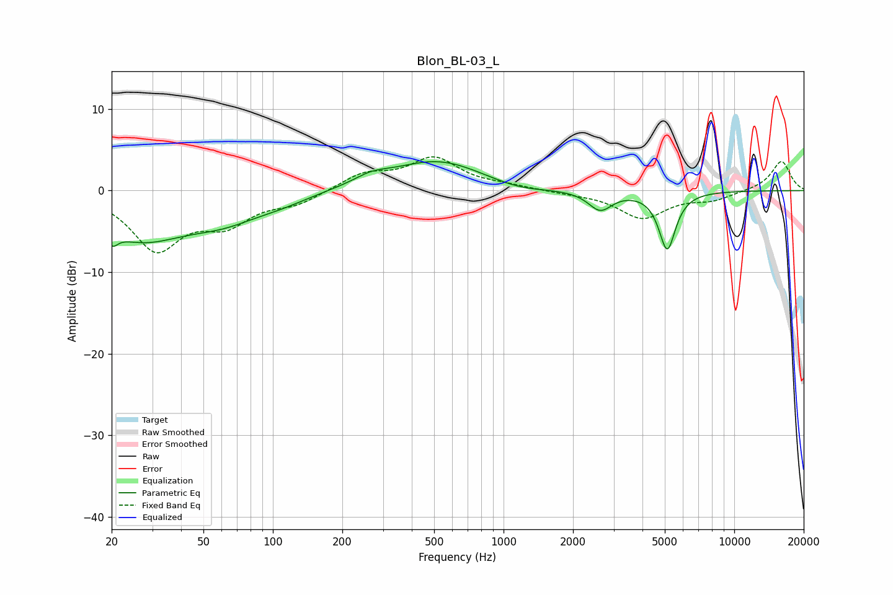

# Blon_BL-03_L
See [usage instructions](https://github.com/jaakkopasanen/AutoEq#usage) for more options and info.

### Parametric EQs
Apply preamp of -3.6 dB when using parametric equalizer.

|   # | Type    |   Fc (Hz) |    Q |   Gain (dB) |
|-----|---------|-----------|------|-------------|
|   1 | Peaking |        20 | 4.75 |         3.8 |
|   2 | Peaking |        20 | 5.16 |        -5.4 |
|   3 | Peaking |        27 | 0.69 |        -5.6 |
|   4 | Peaking |        62 | 0.9  |        -2.4 |
|   5 | Peaking |       108 | 1.12 |        -0.9 |
|   6 | Peaking |       266 | 1.85 |         1   |
|   7 | Peaking |       518 | 0.7  |         3.7 |
|   8 | Peaking |      1150 | 1.13 |        -0.8 |
|   9 | Peaking |      2624 | 2.76 |        -2.4 |
|  10 | Peaking |      5123 | 3.86 |        -7.1 |

### Fixed Band EQs
When using fixed band (also called graphic) equalizer, apply preamp of **-4.2 dB** (if available) and set gains manually with these parameters.

|   # | Type    |   Fc (Hz) |    Q |   Gain (dB) |
|-----|---------|-----------|------|-------------|
|   1 | Peaking |        31 | 1.41 |        -6.9 |
|   2 | Peaking |        62 | 1.41 |        -3.5 |
|   3 | Peaking |       125 | 1.41 |        -1.4 |
|   4 | Peaking |       250 | 1.41 |         2   |
|   5 | Peaking |       500 | 1.41 |         3.8 |
|   6 | Peaking |      1000 | 1.41 |         0.5 |
|   7 | Peaking |      2000 | 1.41 |        -0.3 |
|   8 | Peaking |      4000 | 1.41 |        -3.3 |
|   9 | Peaking |      8000 | 1.41 |        -1   |
|  10 | Peaking |     16000 | 1.41 |         3.6 |

### Graphs

