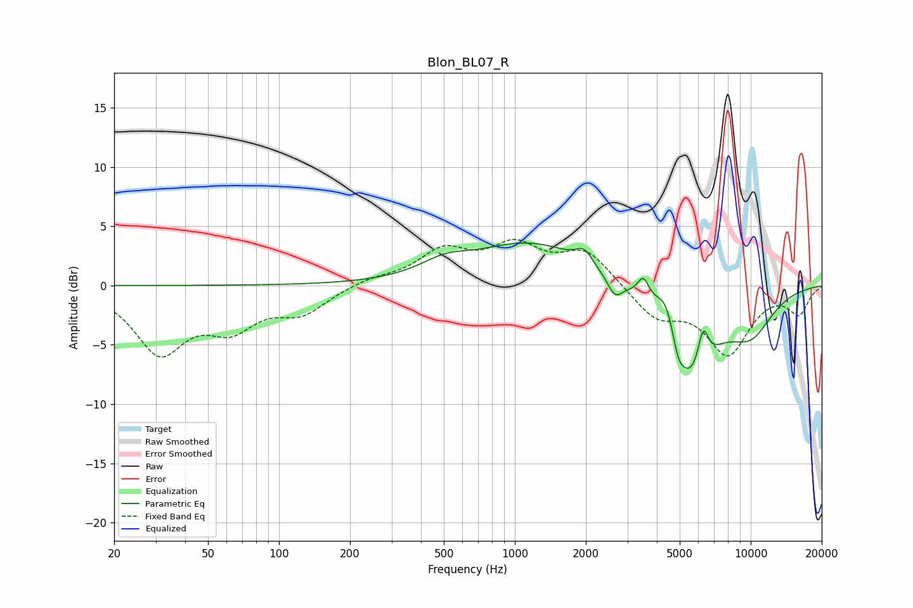

# Blon_BL07_R
See [usage instructions](https://github.com/jaakkopasanen/AutoEq#usage) for more options and info.

### Parametric EQs
Apply preamp of -3.7 dB when using parametric equalizer.

|   # | Type    |   Fc (Hz) |    Q |   Gain (dB) |
|-----|---------|-----------|------|-------------|
|   1 | Peaking |       504 | 1.36 |         1.1 |
|   2 | Peaking |      1175 | 0.6  |         3.6 |
|   3 | Peaking |      1969 | 3.99 |         1.2 |
|   4 | Peaking |      2657 | 4.56 |        -1.5 |
|   5 | Peaking |      3508 | 5.85 |         1.8 |
|   6 | Peaking |      4388 | 3.1  |         3.3 |
|   7 | Peaking |      4919 | 6    |        -1.3 |
|   8 | Peaking |      5509 | 1.38 |        -8.1 |
|   9 | Peaking |      6280 | 5.92 |         3.3 |
|  10 | Peaking |     10000 | 1.24 |        -3.4 |

### Fixed Band EQs
When using fixed band (also called graphic) equalizer, apply preamp of **-4.0 dB** (if available) and set gains manually with these parameters.

|   # | Type    |   Fc (Hz) |    Q |   Gain (dB) |
|-----|---------|-----------|------|-------------|
|   1 | Peaking |        31 | 1.41 |        -5.4 |
|   2 | Peaking |        62 | 1.41 |        -3   |
|   3 | Peaking |       125 | 1.41 |        -2.1 |
|   4 | Peaking |       250 | 1.41 |         0.6 |
|   5 | Peaking |       500 | 1.41 |         2.7 |
|   6 | Peaking |      1000 | 1.41 |         3   |
|   7 | Peaking |      2000 | 1.41 |         2.8 |
|   8 | Peaking |      4000 | 1.41 |        -2.6 |
|   9 | Peaking |      8000 | 1.41 |        -5.5 |
|  10 | Peaking |     16000 | 1.41 |        -2.2 |

### Graphs

