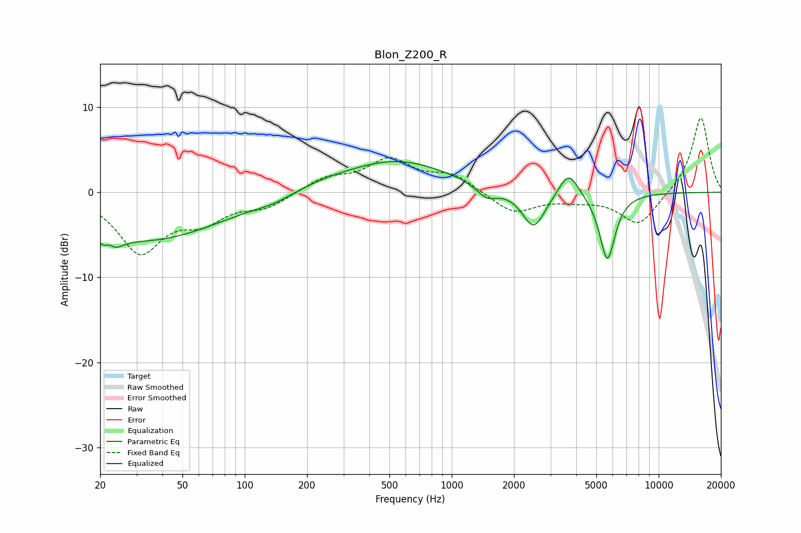

# Blon_Z200_R
See [usage instructions](https://github.com/jaakkopasanen/AutoEq#usage) for more options and info.

### Parametric EQs
Apply preamp of -3.7 dB when using parametric equalizer.

|   # | Type    |   Fc (Hz) |    Q |   Gain (dB) |
|-----|---------|-----------|------|-------------|
|   1 | Peaking |        22 | 3.87 |        -4.9 |
|   2 | Peaking |        22 | 5.33 |         3.5 |
|   3 | Peaking |        34 | 0.4  |        -5.5 |
|   4 | Peaking |       137 | 1.57 |        -0.5 |
|   5 | Peaking |       238 | 1.07 |         0.5 |
|   6 | Peaking |       538 | 0.55 |         3.7 |
|   7 | Peaking |      1478 | 2.79 |        -1.5 |
|   8 | Peaking |      2491 | 2.53 |        -4.5 |
|   9 | Peaking |      3675 | 2.98 |         3   |
|  10 | Peaking |      5652 | 3.61 |        -8   |

### Fixed Band EQs
When using fixed band (also called graphic) equalizer, apply preamp of **-8.8 dB** (if available) and set gains manually with these parameters.

|   # | Type    |   Fc (Hz) |    Q |   Gain (dB) |
|-----|---------|-----------|------|-------------|
|   1 | Peaking |        31 | 1.41 |        -6.8 |
|   2 | Peaking |        62 | 1.41 |        -2.8 |
|   3 | Peaking |       125 | 1.41 |        -1.6 |
|   4 | Peaking |       250 | 1.41 |         1.6 |
|   5 | Peaking |       500 | 1.41 |         3.6 |
|   6 | Peaking |      1000 | 1.41 |         1.9 |
|   7 | Peaking |      2000 | 1.41 |        -2.5 |
|   8 | Peaking |      4000 | 1.41 |        -0.6 |
|   9 | Peaking |      8000 | 1.41 |        -3.9 |
|  10 | Peaking |     16000 | 1.41 |         9   |

### Graphs

