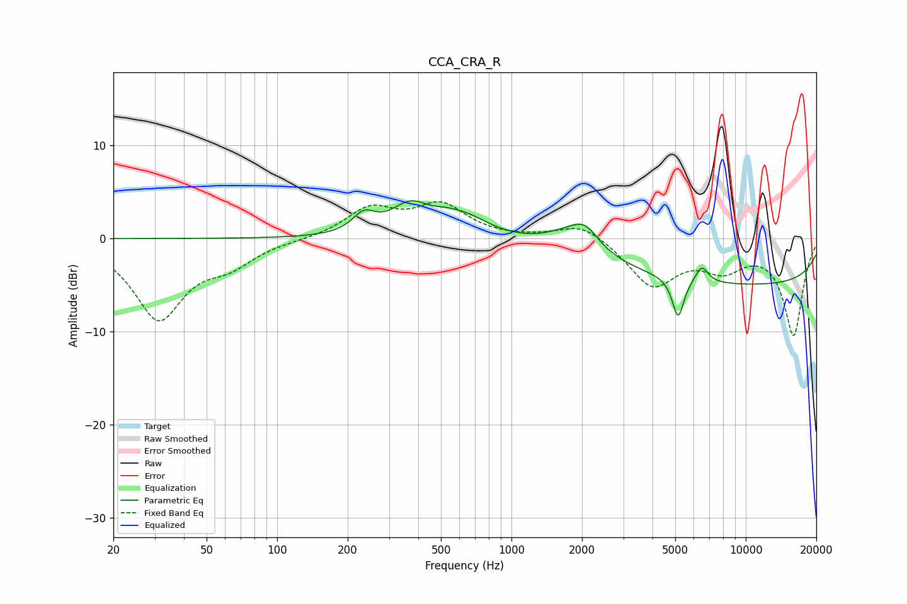

# CCA_CRA_R
See [usage instructions](https://github.com/jaakkopasanen/AutoEq#usage) for more options and info.

### Parametric EQs
Apply preamp of -4.2 dB when using parametric equalizer.

|   # | Type    |   Fc (Hz) |    Q |   Gain (dB) |
|-----|---------|-----------|------|-------------|
|   1 | Peaking |       234 | 2.93 |         2   |
|   2 | Peaking |       371 | 1.67 |         3.2 |
|   3 | Peaking |       518 | 3.08 |         0.4 |
|   4 | Peaking |       630 | 1.35 |         2.1 |
|   5 | Peaking |      1817 | 1.33 |         2.1 |
|   6 | Peaking |      2075 | 2.8  |         2.2 |
|   7 | Peaking |      2090 | 3.39 |        -0.5 |
|   8 | Peaking |      5143 | 5.73 |        -4.3 |
|   9 | Peaking |      6490 | 4.92 |         1.8 |
|  10 | Peaking |     10000 | 0.18 |        -4.9 |

### Fixed Band EQs
When using fixed band (also called graphic) equalizer, apply preamp of **-4.1 dB** (if available) and set gains manually with these parameters.

|   # | Type    |   Fc (Hz) |    Q |   Gain (dB) |
|-----|---------|-----------|------|-------------|
|   1 | Peaking |        31 | 1.41 |        -8.5 |
|   2 | Peaking |        62 | 1.41 |        -2.2 |
|   3 | Peaking |       125 | 1.41 |        -0.1 |
|   4 | Peaking |       250 | 1.41 |         3.1 |
|   5 | Peaking |       500 | 1.41 |         3.4 |
|   6 | Peaking |      1000 | 1.41 |        -0   |
|   7 | Peaking |      2000 | 1.41 |         1.8 |
|   8 | Peaking |      4000 | 1.41 |        -5   |
|   9 | Peaking |      8000 | 1.41 |        -2.7 |
|  10 | Peaking |     16000 | 1.41 |       -10.3 |

### Graphs

