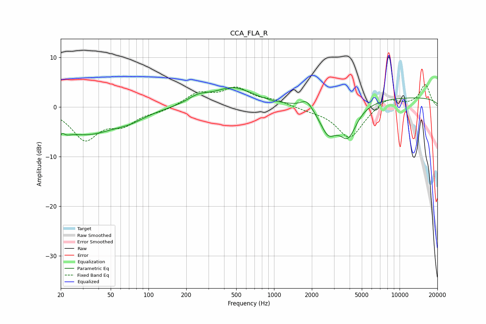

# CCA_FLA_R
See [usage instructions](https://github.com/jaakkopasanen/AutoEq#usage) for more options and info.

### Parametric EQs
Apply preamp of -4.0 dB when using parametric equalizer.

|   # | Type    |   Fc (Hz) |    Q |   Gain (dB) |
|-----|---------|-----------|------|-------------|
|   1 | Peaking |        20 | 3.6  |        -5   |
|   2 | Peaking |        20 | 5.6  |         3.4 |
|   3 | Peaking |        32 | 0.62 |        -5.1 |
|   4 | Peaking |        71 | 1.17 |        -1.3 |
|   5 | Peaking |       248 | 1.62 |         1.5 |
|   6 | Peaking |       477 | 0.9  |         3.7 |
|   7 | Peaking |      1821 | 3.29 |         1.7 |
|   8 | Peaking |      2695 | 2.1  |        -5.3 |
|   9 | Peaking |      3881 | 1.95 |        -6.5 |
|  10 | Peaking |     10000 | 0.18 |         2   |

### Fixed Band EQs
When using fixed band (also called graphic) equalizer, apply preamp of **-4.6 dB** (if available) and set gains manually with these parameters.

|   # | Type    |   Fc (Hz) |    Q |   Gain (dB) |
|-----|---------|-----------|------|-------------|
|   1 | Peaking |        31 | 1.41 |        -6.3 |
|   2 | Peaking |        62 | 1.41 |        -3   |
|   3 | Peaking |       125 | 1.41 |        -0.7 |
|   4 | Peaking |       250 | 1.41 |         2.7 |
|   5 | Peaking |       500 | 1.41 |         3.5 |
|   6 | Peaking |      1000 | 1.41 |         1.2 |
|   7 | Peaking |      2000 | 1.41 |        -0.5 |
|   8 | Peaking |      4000 | 1.41 |        -6.3 |
|   9 | Peaking |      8000 | 1.41 |         2.1 |
|  10 | Peaking |     16000 | 1.41 |         4.5 |

### Graphs

