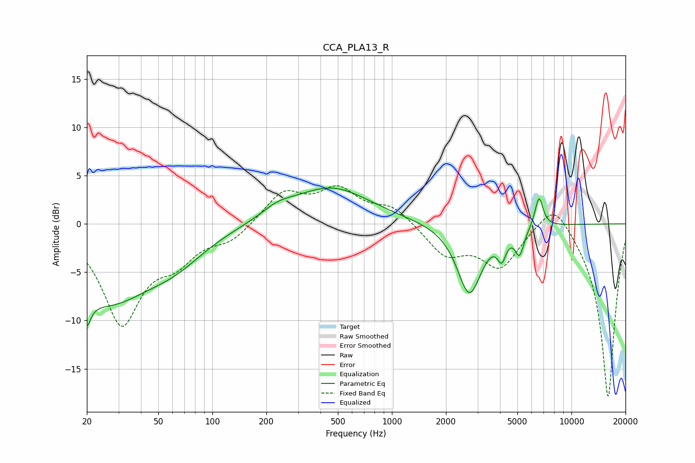

# CCA_PLA13_R
See [usage instructions](https://github.com/jaakkopasanen/AutoEq#usage) for more options and info.

### Parametric EQs
Apply preamp of -3.8 dB when using parametric equalizer.

|   # | Type    |   Fc (Hz) |    Q |   Gain (dB) |
|-----|---------|-----------|------|-------------|
|   1 | Peaking |        20 | 5.96 |        -9.4 |
|   2 | Peaking |        20 | 6    |         6.2 |
|   3 | Peaking |        26 | 0.56 |        -7.6 |
|   4 | Peaking |        62 | 0.85 |        -2.1 |
|   5 | Peaking |       231 | 1.59 |         0.9 |
|   6 | Peaking |       458 | 0.65 |         3.8 |
|   7 | Peaking |      2701 | 2.07 |        -7.3 |
|   8 | Peaking |      4089 | 6    |        -2.2 |
|   9 | Peaking |      5141 | 5.69 |        -2.6 |
|  10 | Peaking |      6596 | 6    |         3.2 |

### Fixed Band EQs
When using fixed band (also called graphic) equalizer, apply preamp of **-4.1 dB** (if available) and set gains manually with these parameters.

|   # | Type    |   Fc (Hz) |    Q |   Gain (dB) |
|-----|---------|-----------|------|-------------|
|   1 | Peaking |        31 | 1.41 |       -10   |
|   2 | Peaking |        62 | 1.41 |        -2.9 |
|   3 | Peaking |       125 | 1.41 |        -1.6 |
|   4 | Peaking |       250 | 1.41 |         3.2 |
|   5 | Peaking |       500 | 1.41 |         3.3 |
|   6 | Peaking |      1000 | 1.41 |         1.7 |
|   7 | Peaking |      2000 | 1.41 |        -3.1 |
|   8 | Peaking |      4000 | 1.41 |        -4.3 |
|   9 | Peaking |      8000 | 1.41 |         3.1 |
|  10 | Peaking |     16000 | 1.41 |       -18.1 |

### Graphs

