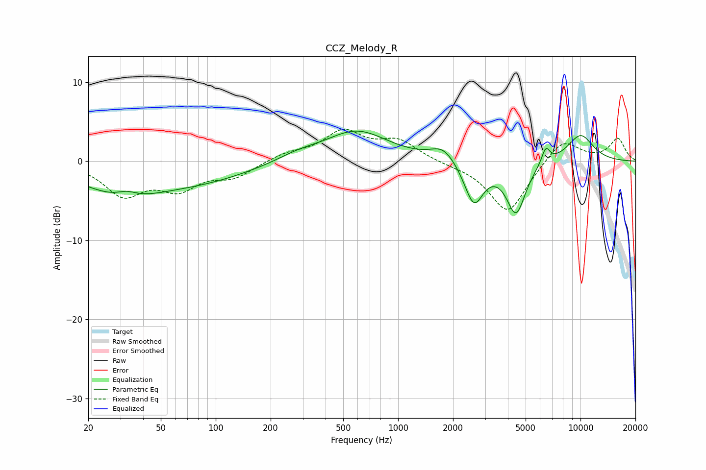

# CCZ_Melody_R
See [usage instructions](https://github.com/jaakkopasanen/AutoEq#usage) for more options and info.

### Parametric EQs
Apply preamp of -3.9 dB when using parametric equalizer.

|   # | Type    |   Fc (Hz) |    Q |   Gain (dB) |
|-----|---------|-----------|------|-------------|
|   1 | Peaking |        30 | 0.63 |        -3.8 |
|   2 | Peaking |        33 | 2.54 |         0.8 |
|   3 | Peaking |        87 | 0.52 |        -2   |
|   4 | Peaking |       282 | 1.22 |         0.8 |
|   5 | Peaking |       591 | 0.82 |         3.8 |
|   6 | Peaking |      1764 | 2.11 |         1.8 |
|   7 | Peaking |      2603 | 2.69 |        -5.4 |
|   8 | Peaking |      4432 | 2.66 |        -6.5 |
|   9 | Peaking |      6448 | 6    |         2   |
|  10 | Peaking |     10000 | 1.65 |         3.4 |

### Fixed Band EQs
When using fixed band (also called graphic) equalizer, apply preamp of **-4.1 dB** (if available) and set gains manually with these parameters.

|   # | Type    |   Fc (Hz) |    Q |   Gain (dB) |
|-----|---------|-----------|------|-------------|
|   1 | Peaking |        31 | 1.41 |        -4   |
|   2 | Peaking |        62 | 1.41 |        -3.1 |
|   3 | Peaking |       125 | 1.41 |        -1.8 |
|   4 | Peaking |       250 | 1.41 |         0.9 |
|   5 | Peaking |       500 | 1.41 |         3.6 |
|   6 | Peaking |      1000 | 1.41 |         2.4 |
|   7 | Peaking |      2000 | 1.41 |        -0.3 |
|   8 | Peaking |      4000 | 1.41 |        -6.6 |
|   9 | Peaking |      8000 | 1.41 |         3   |
|  10 | Peaking |     16000 | 1.41 |         2.8 |

### Graphs

