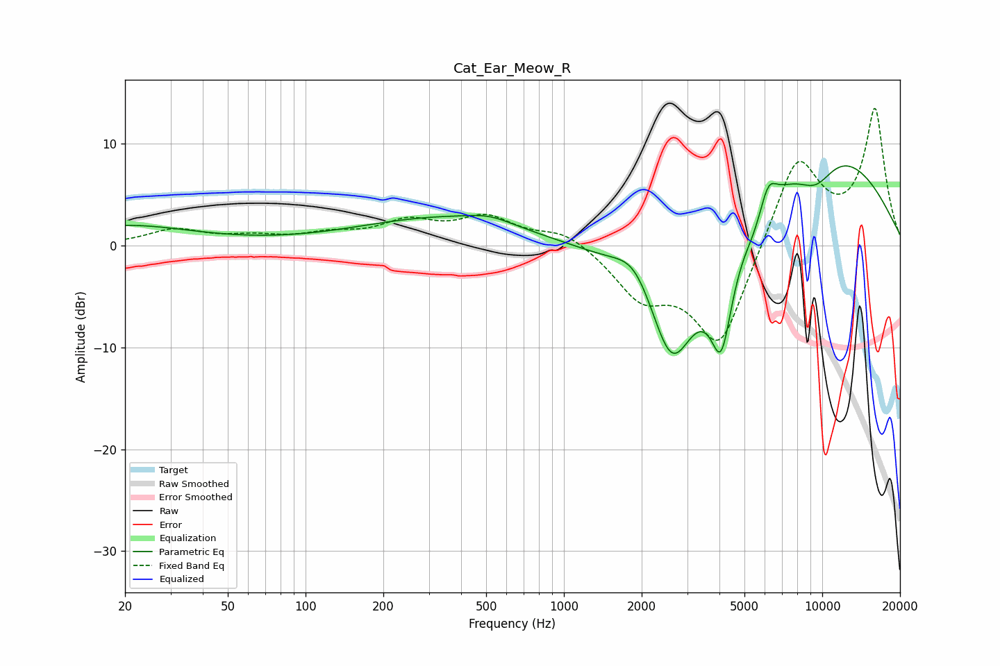

# Cat_Ear_Meow_R
See [usage instructions](https://github.com/jaakkopasanen/AutoEq#usage) for more options and info.

### Parametric EQs
Apply preamp of -7.9 dB when using parametric equalizer.

|   # | Type    |   Fc (Hz) |    Q |   Gain (dB) |
|-----|---------|-----------|------|-------------|
|   1 | Peaking |        20 | 0.54 |         1.9 |
|   2 | Peaking |       340 | 0.43 |         2.7 |
|   3 | Peaking |       517 | 1.62 |         0.7 |
|   4 | Peaking |      1892 | 1.76 |         3.3 |
|   5 | Peaking |      2619 | 1.27 |       -13.7 |
|   6 | Peaking |      4068 | 3.12 |        -9.7 |
|   7 | Peaking |      5433 | 3.49 |        -1.2 |
|   8 | Peaking |      6185 | 4.34 |         2.4 |
|   9 | Peaking |      9437 | 1.62 |        -3.2 |
|  10 | Peaking |     10000 | 0.39 |        10.1 |

### Fixed Band EQs
When using fixed band (also called graphic) equalizer, apply preamp of **-13.5 dB** (if available) and set gains manually with these parameters.

|   # | Type    |   Fc (Hz) |    Q |   Gain (dB) |
|-----|---------|-----------|------|-------------|
|   1 | Peaking |        31 | 1.41 |         1.5 |
|   2 | Peaking |        62 | 1.41 |         0.7 |
|   3 | Peaking |       125 | 1.41 |         0.9 |
|   4 | Peaking |       250 | 1.41 |         2.1 |
|   5 | Peaking |       500 | 1.41 |         2.6 |
|   6 | Peaking |      1000 | 1.41 |         1.6 |
|   7 | Peaking |      2000 | 1.41 |        -4.5 |
|   8 | Peaking |      4000 | 1.41 |       -10.1 |
|   9 | Peaking |      8000 | 1.41 |         9   |
|  10 | Peaking |     16000 | 1.41 |        13.2 |

### Graphs

