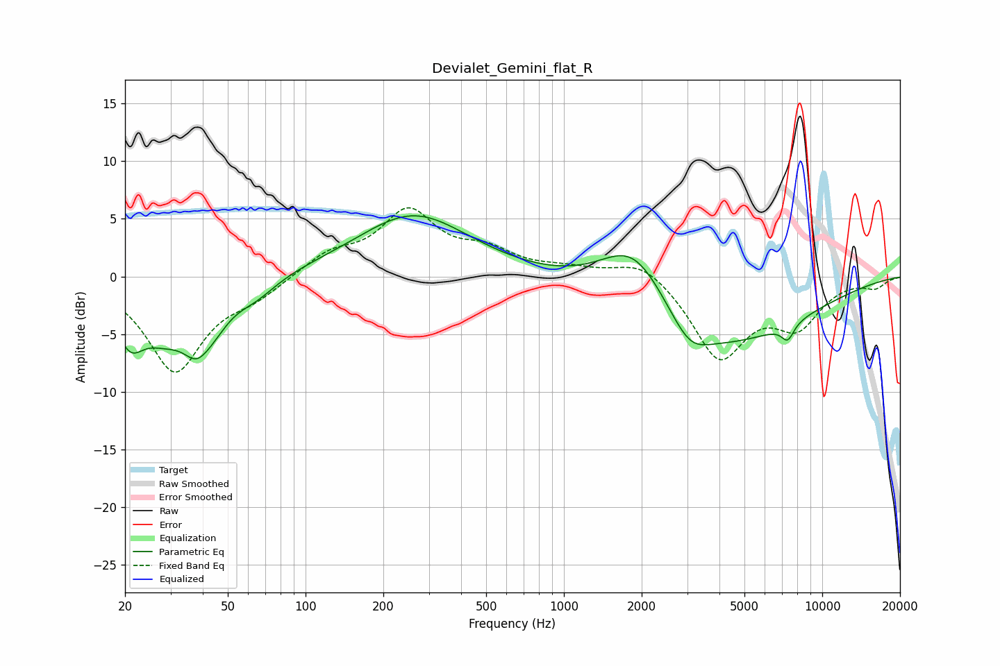

# Devialet_Gemini_flat_R
See [usage instructions](https://github.com/jaakkopasanen/AutoEq#usage) for more options and info.

### Parametric EQs
Apply preamp of -5.4 dB when using parametric equalizer.

|   # | Type    |   Fc (Hz) |    Q |   Gain (dB) |
|-----|---------|-----------|------|-------------|
|   1 | Peaking |        21 | 2.52 |        -4.2 |
|   2 | Peaking |        28 | 1.5  |        -3.7 |
|   3 | Peaking |        38 | 2.6  |        -3.2 |
|   4 | Peaking |        44 | 2.13 |        -2.1 |
|   5 | Peaking |        64 | 1.66 |        -1.5 |
|   6 | Peaking |       262 | 0.65 |         5.4 |
|   7 | Peaking |      1872 | 1    |         6.2 |
|   8 | Peaking |      3064 | 1.91 |        -2.2 |
|   9 | Peaking |      3716 | 0.41 |        -6.4 |
|  10 | Peaking |      7354 | 5.4  |        -1.4 |

### Fixed Band EQs
When using fixed band (also called graphic) equalizer, apply preamp of **-6.1 dB** (if available) and set gains manually with these parameters.

|   # | Type    |   Fc (Hz) |    Q |   Gain (dB) |
|-----|---------|-----------|------|-------------|
|   1 | Peaking |        31 | 1.41 |        -8.1 |
|   2 | Peaking |        62 | 1.41 |        -1.4 |
|   3 | Peaking |       125 | 1.41 |         1.8 |
|   4 | Peaking |       250 | 1.41 |         5.4 |
|   5 | Peaking |       500 | 1.41 |         1.8 |
|   6 | Peaking |      1000 | 1.41 |         0.6 |
|   7 | Peaking |      2000 | 1.41 |         1.7 |
|   8 | Peaking |      4000 | 1.41 |        -7   |
|   9 | Peaking |      8000 | 1.41 |        -3.8 |
|  10 | Peaking |     16000 | 1.41 |        -0.8 |

### Graphs

