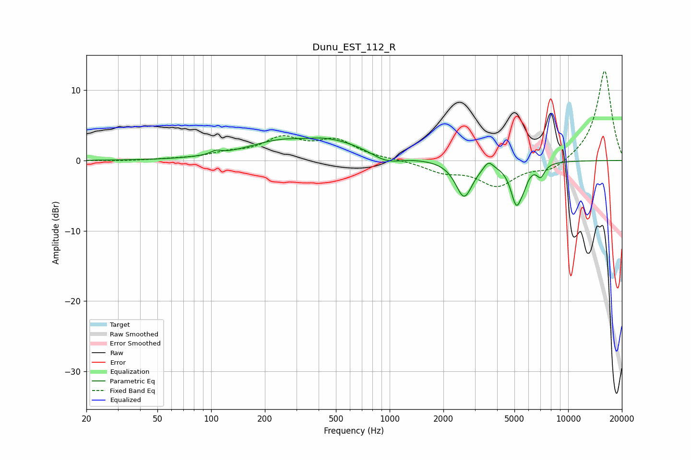

# Dunu_EST_112_R
See [usage instructions](https://github.com/jaakkopasanen/AutoEq#usage) for more options and info.

### Parametric EQs
Apply preamp of -3.3 dB when using parametric equalizer.

|   # | Type    |   Fc (Hz) |    Q |   Gain (dB) |
|-----|---------|-----------|------|-------------|
|   1 | Peaking |       106 | 4.93 |         0.5 |
|   2 | Peaking |       224 | 0.86 |         0.8 |
|   3 | Peaking |       325 | 1.9  |        -0.4 |
|   4 | Peaking |       403 | 0.53 |         3.2 |
|   5 | Peaking |       957 | 1.62 |        -1.4 |
|   6 | Peaking |      2612 | 3.01 |        -5.2 |
|   7 | Peaking |      3573 | 5.82 |         1.1 |
|   8 | Peaking |      5131 | 4.32 |        -5.7 |
|   9 | Peaking |      5653 | 6    |        -1.2 |
|  10 | Peaking |      7020 | 6    |        -1.7 |

### Fixed Band EQs
When using fixed band (also called graphic) equalizer, apply preamp of **-12.8 dB** (if available) and set gains manually with these parameters.

|   # | Type    |   Fc (Hz) |    Q |   Gain (dB) |
|-----|---------|-----------|------|-------------|
|   1 | Peaking |        31 | 1.41 |        -0.1 |
|   2 | Peaking |        62 | 1.41 |         0.1 |
|   3 | Peaking |       125 | 1.41 |         0.9 |
|   4 | Peaking |       250 | 1.41 |         2.9 |
|   5 | Peaking |       500 | 1.41 |         2.6 |
|   6 | Peaking |      1000 | 1.41 |         0.1 |
|   7 | Peaking |      2000 | 1.41 |        -1.5 |
|   8 | Peaking |      4000 | 1.41 |        -3.4 |
|   9 | Peaking |      8000 | 1.41 |        -1.5 |
|  10 | Peaking |     16000 | 1.41 |        12.9 |

### Graphs

