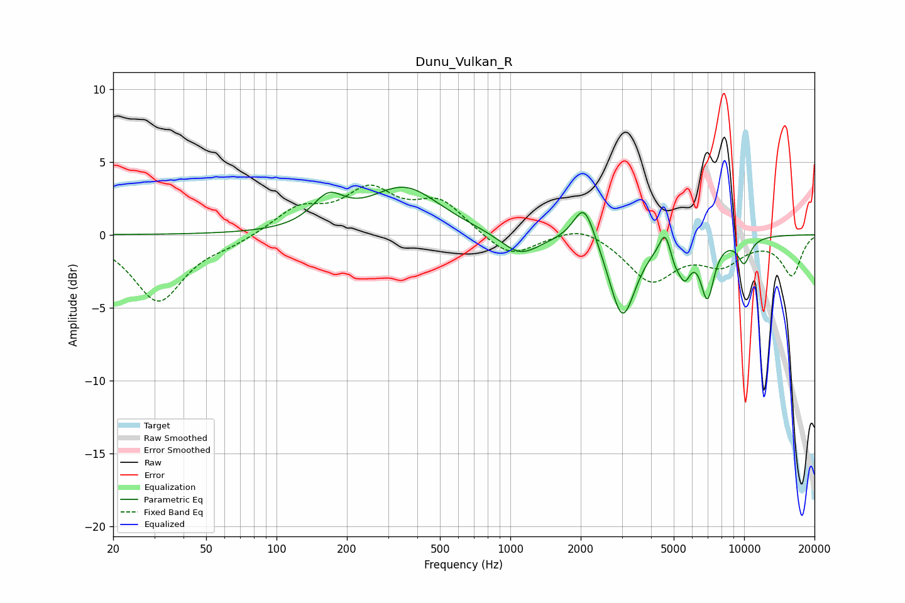

# Dunu_Vulkan_R
See [usage instructions](https://github.com/jaakkopasanen/AutoEq#usage) for more options and info.

### Parametric EQs
Apply preamp of -3.4 dB when using parametric equalizer.

|   # | Type    |   Fc (Hz) |    Q |   Gain (dB) |
|-----|---------|-----------|------|-------------|
|   1 | Peaking |       166 | 2.08 |         2   |
|   2 | Peaking |       353 | 0.94 |         3.2 |
|   3 | Peaking |      1101 | 1.69 |        -1.5 |
|   4 | Peaking |      2071 | 3.12 |         2.8 |
|   5 | Peaking |      3017 | 2.54 |        -5.7 |
|   6 | Peaking |      4587 | 6    |         1.6 |
|   7 | Peaking |      5084 | 6    |        -1   |
|   8 | Peaking |      5575 | 5.32 |        -2   |
|   9 | Peaking |      6962 | 4.67 |        -3.9 |
|  10 | Peaking |     10000 | 4.52 |        -1.7 |

### Fixed Band EQs
When using fixed band (also called graphic) equalizer, apply preamp of **-3.5 dB** (if available) and set gains manually with these parameters.

|   # | Type    |   Fc (Hz) |    Q |   Gain (dB) |
|-----|---------|-----------|------|-------------|
|   1 | Peaking |        31 | 1.41 |        -4.6 |
|   2 | Peaking |        62 | 1.41 |        -0.5 |
|   3 | Peaking |       125 | 1.41 |         1.7 |
|   4 | Peaking |       250 | 1.41 |         2.8 |
|   5 | Peaking |       500 | 1.41 |         2.2 |
|   6 | Peaking |      1000 | 1.41 |        -1.7 |
|   7 | Peaking |      2000 | 1.41 |         0.8 |
|   8 | Peaking |      4000 | 1.41 |        -3.1 |
|   9 | Peaking |      8000 | 1.41 |        -1.8 |
|  10 | Peaking |     16000 | 1.41 |        -2.7 |

### Graphs

