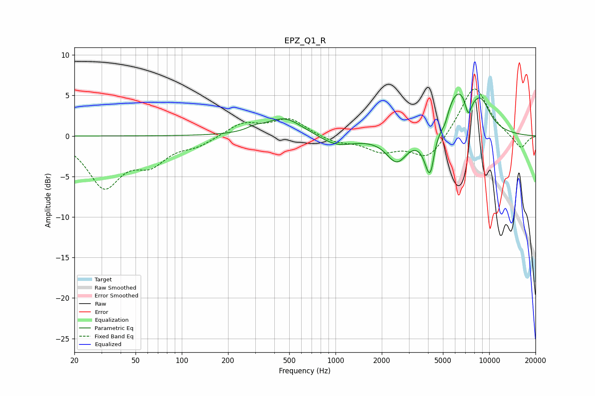

# EPZ_Q1_R
See [usage instructions](https://github.com/jaakkopasanen/AutoEq#usage) for more options and info.

### Parametric EQs
Apply preamp of -5.3 dB when using parametric equalizer.

|   # | Type    |   Fc (Hz) |    Q |   Gain (dB) |
|-----|---------|-----------|------|-------------|
|   1 | Peaking |       300 | 2.76 |         0.5 |
|   2 | Peaking |       467 | 1.2  |         2.3 |
|   3 | Peaking |      1026 | 1.25 |        -1.3 |
|   4 | Peaking |      2507 | 2.08 |        -3.3 |
|   5 | Peaking |      4155 | 3.73 |        -6.8 |
|   6 | Peaking |      4422 | 6    |         1.3 |
|   7 | Peaking |      5151 | 6    |        -1.1 |
|   8 | Peaking |      6274 | 1.38 |         5.9 |
|   9 | Peaking |      7310 | 6    |        -2.6 |
|  10 | Peaking |      8879 | 2.23 |         2.7 |

### Fixed Band EQs
When using fixed band (also called graphic) equalizer, apply preamp of **-5.9 dB** (if available) and set gains manually with these parameters.

|   # | Type    |   Fc (Hz) |    Q |   Gain (dB) |
|-----|---------|-----------|------|-------------|
|   1 | Peaking |        31 | 1.41 |        -6   |
|   2 | Peaking |        62 | 1.41 |        -2.9 |
|   3 | Peaking |       125 | 1.41 |        -1   |
|   4 | Peaking |       250 | 1.41 |         1.6 |
|   5 | Peaking |       500 | 1.41 |         2.1 |
|   6 | Peaking |      1000 | 1.41 |        -0.8 |
|   7 | Peaking |      2000 | 1.41 |        -1.7 |
|   8 | Peaking |      4000 | 1.41 |        -3   |
|   9 | Peaking |      8000 | 1.41 |         6.3 |
|  10 | Peaking |     16000 | 1.41 |        -1.7 |

### Graphs

