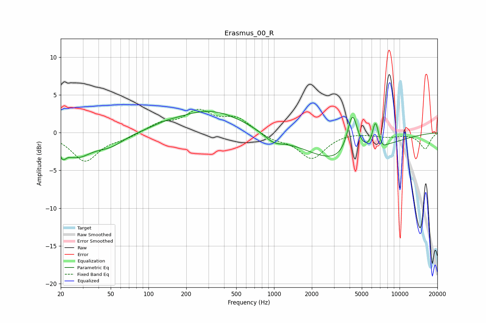

# Erasmus_00_R
See [usage instructions](https://github.com/jaakkopasanen/AutoEq#usage) for more options and info.

### Parametric EQs
Apply preamp of -2.9 dB when using parametric equalizer.

|   # | Type    |   Fc (Hz) |    Q |   Gain (dB) |
|-----|---------|-----------|------|-------------|
|   1 | Peaking |        21 | 5.41 |        -1.3 |
|   2 | Peaking |        27 | 1.19 |        -2.9 |
|   3 | Peaking |        50 | 1.25 |        -1.4 |
|   4 | Peaking |       135 | 1.64 |         0.3 |
|   5 | Peaking |       309 | 0.52 |         3   |
|   6 | Peaking |       989 | 1.77 |        -1.1 |
|   7 | Peaking |      3529 | 0.5  |        -4.1 |
|   8 | Peaking |      4214 | 3.33 |         5.8 |
|   9 | Peaking |      6420 | 5.54 |         3.5 |
|  10 | Peaking |      7362 | 6    |        -0.5 |

### Fixed Band EQs
When using fixed band (also called graphic) equalizer, apply preamp of **-3.2 dB** (if available) and set gains manually with these parameters.

|   # | Type    |   Fc (Hz) |    Q |   Gain (dB) |
|-----|---------|-----------|------|-------------|
|   1 | Peaking |        31 | 1.41 |        -3.7 |
|   2 | Peaking |        62 | 1.41 |        -0.6 |
|   3 | Peaking |       125 | 1.41 |         1.1 |
|   4 | Peaking |       250 | 1.41 |         2.7 |
|   5 | Peaking |       500 | 1.41 |         1.9 |
|   6 | Peaking |      1000 | 1.41 |        -0.8 |
|   7 | Peaking |      2000 | 1.41 |        -3.4 |
|   8 | Peaking |      4000 | 1.41 |         0.2 |
|   9 | Peaking |      8000 | 1.41 |        -0.5 |
|  10 | Peaking |     16000 | 1.41 |        -2.1 |

### Graphs

