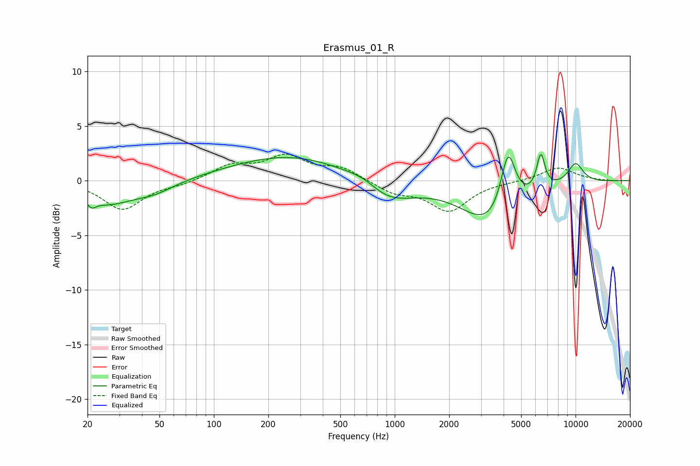

# Erasmus_01_R
See [usage instructions](https://github.com/jaakkopasanen/AutoEq#usage) for more options and info.

### Parametric EQs
Apply preamp of -2.5 dB when using parametric equalizer.

|   # | Type    |   Fc (Hz) |    Q |   Gain (dB) |
|-----|---------|-----------|------|-------------|
|   1 | Peaking |        21 | 5.7  |        -0.7 |
|   2 | Peaking |        26 | 1    |        -2   |
|   3 | Peaking |        47 | 1.23 |        -0.9 |
|   4 | Peaking |       270 | 0.42 |         2.4 |
|   5 | Peaking |       679 | 1.55 |         0.8 |
|   6 | Peaking |       893 | 0.94 |        -2.3 |
|   7 | Peaking |      3426 | 0.91 |        -4.1 |
|   8 | Peaking |      4233 | 3.33 |         5.6 |
|   9 | Peaking |      6425 | 5.99 |         3.2 |
|  10 | Peaking |     10000 | 2.83 |         1.9 |

### Fixed Band EQs
When using fixed band (also called graphic) equalizer, apply preamp of **-2.5 dB** (if available) and set gains manually with these parameters.

|   # | Type    |   Fc (Hz) |    Q |   Gain (dB) |
|-----|---------|-----------|------|-------------|
|   1 | Peaking |        31 | 1.41 |        -2.6 |
|   2 | Peaking |        62 | 1.41 |        -0.3 |
|   3 | Peaking |       125 | 1.41 |         1.3 |
|   4 | Peaking |       250 | 1.41 |         2.1 |
|   5 | Peaking |       500 | 1.41 |         1.1 |
|   6 | Peaking |      1000 | 1.41 |        -1   |
|   7 | Peaking |      2000 | 1.41 |        -2.7 |
|   8 | Peaking |      4000 | 1.41 |        -0.1 |
|   9 | Peaking |      8000 | 1.41 |         1.2 |
|  10 | Peaking |     16000 | 1.41 |        -0   |

### Graphs

