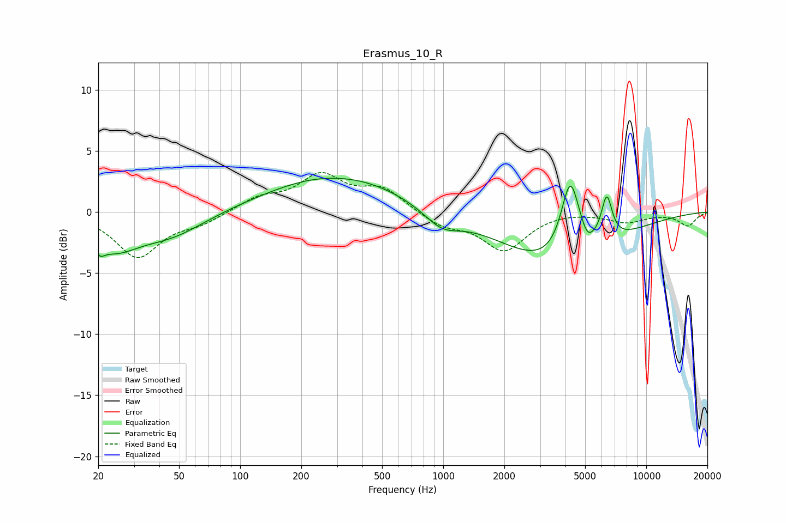

# Erasmus_10_R
See [usage instructions](https://github.com/jaakkopasanen/AutoEq#usage) for more options and info.

### Parametric EQs
Apply preamp of -2.9 dB when using parametric equalizer.

|   # | Type    |   Fc (Hz) |    Q |   Gain (dB) |
|-----|---------|-----------|------|-------------|
|   1 | Peaking |        20 | 5.89 |        -0.8 |
|   2 | Peaking |        24 | 1.18 |        -2.6 |
|   3 | Peaking |        45 | 0.82 |        -1.8 |
|   4 | Peaking |       296 | 0.43 |         3.1 |
|   5 | Peaking |       298 | 1.46 |        -0.1 |
|   6 | Peaking |       981 | 1.6  |        -1.5 |
|   7 | Peaking |      3662 | 0.53 |        -4.4 |
|   8 | Peaking |      4226 | 3.05 |         6.3 |
|   9 | Peaking |      5129 | 5.38 |        -0.7 |
|  10 | Peaking |      6386 | 5.11 |         3.6 |

### Fixed Band EQs
When using fixed band (also called graphic) equalizer, apply preamp of **-3.3 dB** (if available) and set gains manually with these parameters.

|   # | Type    |   Fc (Hz) |    Q |   Gain (dB) |
|-----|---------|-----------|------|-------------|
|   1 | Peaking |        31 | 1.41 |        -3.7 |
|   2 | Peaking |        62 | 1.41 |        -0.8 |
|   3 | Peaking |       125 | 1.41 |         1.1 |
|   4 | Peaking |       250 | 1.41 |         2.8 |
|   5 | Peaking |       500 | 1.41 |         1.8 |
|   6 | Peaking |      1000 | 1.41 |        -1.1 |
|   7 | Peaking |      2000 | 1.41 |        -3.1 |
|   8 | Peaking |      4000 | 1.41 |         0.1 |
|   9 | Peaking |      8000 | 1.41 |        -0.8 |
|  10 | Peaking |     16000 | 1.41 |        -1.1 |

### Graphs

