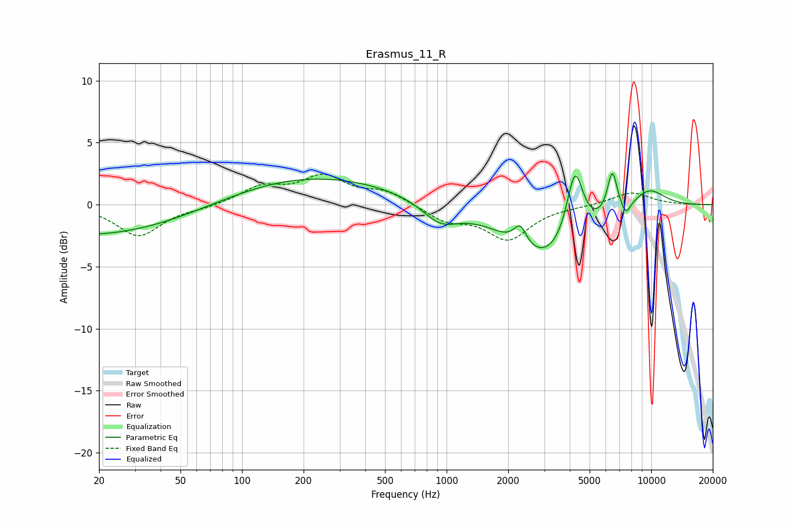

# Erasmus_11_R
See [usage instructions](https://github.com/jaakkopasanen/AutoEq#usage) for more options and info.

### Parametric EQs
Apply preamp of -2.6 dB when using parametric equalizer.

|   # | Type    |   Fc (Hz) |    Q |   Gain (dB) |
|-----|---------|-----------|------|-------------|
|   1 | Peaking |        23 | 0.25 |        -2.7 |
|   2 | Peaking |       154 | 0.3  |         2.1 |
|   3 | Peaking |       391 | 0.27 |         0.6 |
|   4 | Peaking |       932 | 1.55 |        -1.7 |
|   5 | Peaking |      2290 | 4.51 |         1.6 |
|   6 | Peaking |      3104 | 0.73 |        -4.7 |
|   7 | Peaking |      4235 | 3.38 |         5.7 |
|   8 | Peaking |      6455 | 5.56 |         3.5 |
|   9 | Peaking |      7525 | 6    |        -1   |
|  10 | Peaking |      9710 | 1.47 |         1.6 |

### Fixed Band EQs
When using fixed band (also called graphic) equalizer, apply preamp of **-2.6 dB** (if available) and set gains manually with these parameters.

|   # | Type    |   Fc (Hz) |    Q |   Gain (dB) |
|-----|---------|-----------|------|-------------|
|   1 | Peaking |        31 | 1.41 |        -2.5 |
|   2 | Peaking |        62 | 1.41 |        -0.2 |
|   3 | Peaking |       125 | 1.41 |         1.3 |
|   4 | Peaking |       250 | 1.41 |         2.1 |
|   5 | Peaking |       500 | 1.41 |         1   |
|   6 | Peaking |      1000 | 1.41 |        -1.2 |
|   7 | Peaking |      2000 | 1.41 |        -2.7 |
|   8 | Peaking |      4000 | 1.41 |        -0.1 |
|   9 | Peaking |      8000 | 1.41 |         1   |
|  10 | Peaking |     16000 | 1.41 |        -0   |

### Graphs

