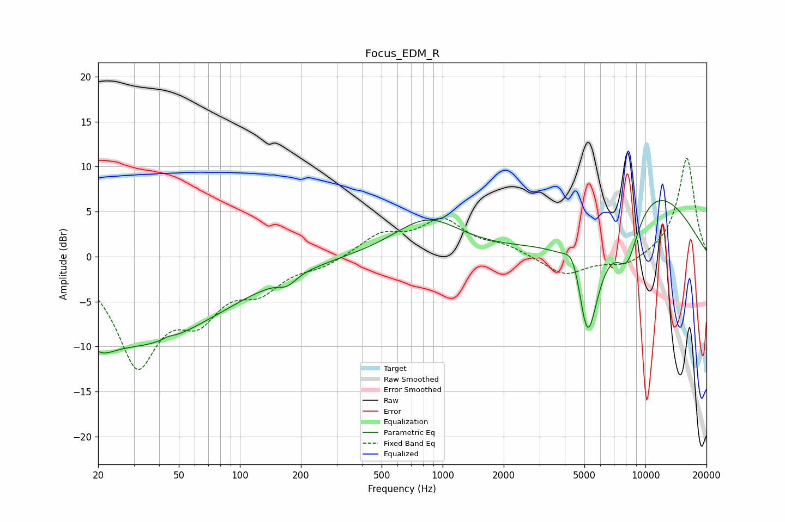

# Focus_EDM_R
See [usage instructions](https://github.com/jaakkopasanen/AutoEq#usage) for more options and info.

### Parametric EQs
Apply preamp of -6.3 dB when using parametric equalizer.

|   # | Type    |   Fc (Hz) |    Q |   Gain (dB) |
|-----|---------|-----------|------|-------------|
|   1 | Peaking |        20 | 5.63 |        -0   |
|   2 | Peaking |        20 | 2    |        -2.2 |
|   3 | Peaking |        33 | 0.34 |        -9.4 |
|   4 | Peaking |        44 | 5.94 |         0.3 |
|   5 | Peaking |       171 | 3.32 |        -1   |
|   6 | Peaking |       841 | 0.86 |         4.1 |
|   7 | Peaking |      4431 | 3.2  |         3.6 |
|   8 | Peaking |      5176 | 2.29 |       -13.6 |
|   9 | Peaking |      8143 | 2.2  |        -6   |
|  10 | Peaking |     10000 | 0.45 |         8.1 |

### Fixed Band EQs
When using fixed band (also called graphic) equalizer, apply preamp of **-11.0 dB** (if available) and set gains manually with these parameters.

|   # | Type    |   Fc (Hz) |    Q |   Gain (dB) |
|-----|---------|-----------|------|-------------|
|   1 | Peaking |        31 | 1.41 |       -11.4 |
|   2 | Peaking |        62 | 1.41 |        -5.2 |
|   3 | Peaking |       125 | 1.41 |        -3.1 |
|   4 | Peaking |       250 | 1.41 |        -0.9 |
|   5 | Peaking |       500 | 1.41 |         2.3 |
|   6 | Peaking |      1000 | 1.41 |         3.8 |
|   7 | Peaking |      2000 | 1.41 |         1   |
|   8 | Peaking |      4000 | 1.41 |        -2.1 |
|   9 | Peaking |      8000 | 1.41 |        -1.2 |
|  10 | Peaking |     16000 | 1.41 |        11.1 |

### Graphs

