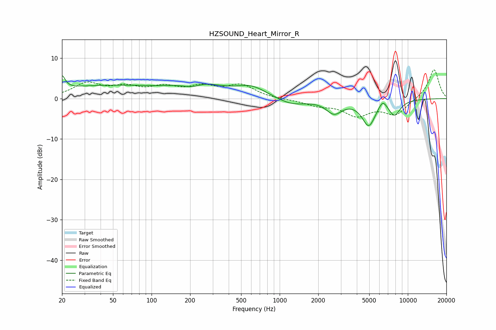

# HZSOUND_Heart_Mirror_R
See [usage instructions](https://github.com/jaakkopasanen/AutoEq#usage) for more options and info.

### Parametric EQs
Apply preamp of -5.8 dB when using parametric equalizer.

|   # | Type    |   Fc (Hz) |    Q |   Gain (dB) |
|-----|---------|-----------|------|-------------|
|   1 | Peaking |        20 | 6    |         3.2 |
|   2 | Peaking |        45 | 0.3  |         3.1 |
|   3 | Peaking |       208 | 1.97 |        -1.5 |
|   4 | Peaking |       236 | 0.85 |         3.2 |
|   5 | Peaking |       601 | 1.18 |         2.6 |
|   6 | Peaking |      1236 | 1.26 |        -1.7 |
|   7 | Peaking |      2658 | 2.31 |        -3.3 |
|   8 | Peaking |      4956 | 2.65 |        -6.3 |
|   9 | Peaking |      6369 | 4.24 |         2.1 |
|  10 | Peaking |      7860 | 2.87 |        -3.7 |

### Fixed Band EQs
When using fixed band (also called graphic) equalizer, apply preamp of **-7.2 dB** (if available) and set gains manually with these parameters.

|   # | Type    |   Fc (Hz) |    Q |   Gain (dB) |
|-----|---------|-----------|------|-------------|
|   1 | Peaking |        31 | 1.41 |         3.5 |
|   2 | Peaking |        62 | 1.41 |         2.4 |
|   3 | Peaking |       125 | 1.41 |         2.4 |
|   4 | Peaking |       250 | 1.41 |         2.5 |
|   5 | Peaking |       500 | 1.41 |         3.1 |
|   6 | Peaking |      1000 | 1.41 |        -0.2 |
|   7 | Peaking |      2000 | 1.41 |        -1.5 |
|   8 | Peaking |      4000 | 1.41 |        -3.9 |
|   9 | Peaking |      8000 | 1.41 |        -3.8 |
|  10 | Peaking |     16000 | 1.41 |         7.4 |

### Graphs

