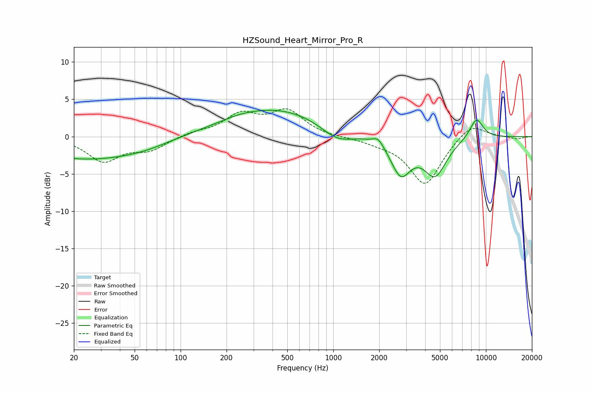

# HZSound_Heart_Mirror_Pro_R
See [usage instructions](https://github.com/jaakkopasanen/AutoEq#usage) for more options and info.

### Parametric EQs
Apply preamp of -3.6 dB when using parametric equalizer.

|   # | Type    |   Fc (Hz) |    Q |   Gain (dB) |
|-----|---------|-----------|------|-------------|
|   1 | Peaking |        20 | 3.12 |        -0.2 |
|   2 | Peaking |        25 | 0.49 |        -2.8 |
|   3 | Peaking |        58 | 0.81 |        -0.8 |
|   4 | Peaking |       243 | 1.36 |         0.2 |
|   5 | Peaking |       425 | 0.43 |         3.7 |
|   6 | Peaking |      1057 | 1.31 |        -2   |
|   7 | Peaking |      1970 | 4.17 |         1   |
|   8 | Peaking |      2770 | 2.14 |        -4.8 |
|   9 | Peaking |      4645 | 1.86 |        -4.9 |
|  10 | Peaking |      8665 | 2.89 |         2.8 |

### Fixed Band EQs
When using fixed band (also called graphic) equalizer, apply preamp of **-3.8 dB** (if available) and set gains manually with these parameters.

|   # | Type    |   Fc (Hz) |    Q |   Gain (dB) |
|-----|---------|-----------|------|-------------|
|   1 | Peaking |        31 | 1.41 |        -3.2 |
|   2 | Peaking |        62 | 1.41 |        -1.6 |
|   3 | Peaking |       125 | 1.41 |         0.5 |
|   4 | Peaking |       250 | 1.41 |         2.8 |
|   5 | Peaking |       500 | 1.41 |         3.3 |
|   6 | Peaking |      1000 | 1.41 |        -0.1 |
|   7 | Peaking |      2000 | 1.41 |        -0.6 |
|   8 | Peaking |      4000 | 1.41 |        -6.5 |
|   9 | Peaking |      8000 | 1.41 |         2   |
|  10 | Peaking |     16000 | 1.41 |        -0.3 |

### Graphs

