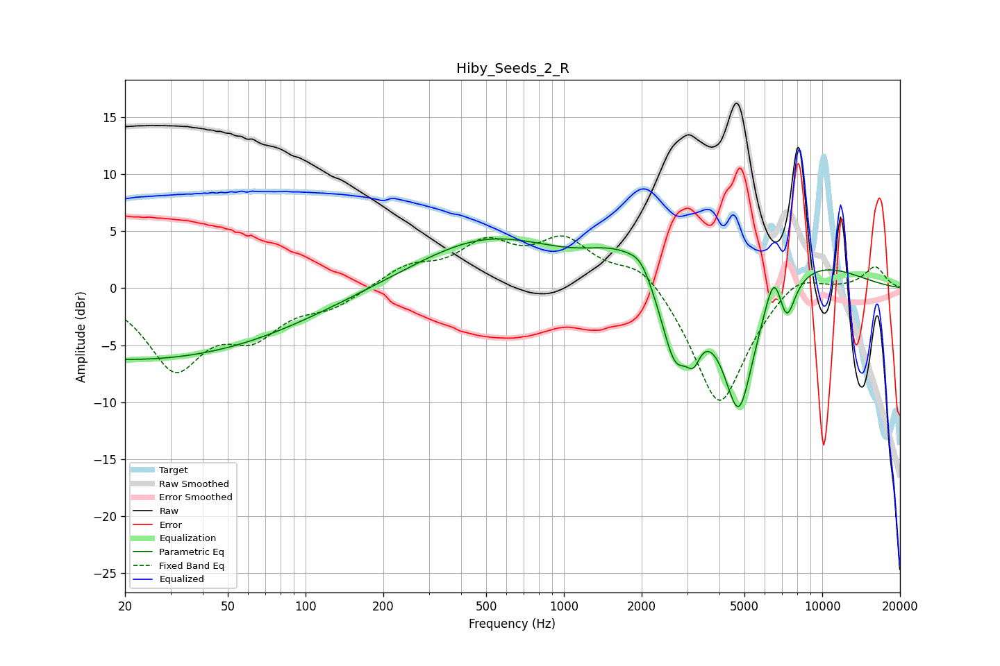

# Hiby_Seeds_2_R
See [usage instructions](https://github.com/jaakkopasanen/AutoEq#usage) for more options and info.

### Parametric EQs
Apply preamp of -4.4 dB when using parametric equalizer.

|   # | Type    |   Fc (Hz) |    Q |   Gain (dB) |
|-----|---------|-----------|------|-------------|
|   1 | Peaking |        21 | 0.21 |        -6.3 |
|   2 | Peaking |       508 | 0.5  |         4.4 |
|   3 | Peaking |      1678 | 1.1  |         2.7 |
|   4 | Peaking |      1988 | 3.39 |         1.3 |
|   5 | Peaking |      2690 | 2.55 |        -6.7 |
|   6 | Peaking |      3174 | 5.17 |        -2.4 |
|   7 | Peaking |      4754 | 2.19 |       -11.5 |
|   8 | Peaking |      6512 | 4.04 |         3.5 |
|   9 | Peaking |      7273 | 4.14 |        -3.7 |
|  10 | Peaking |      8989 | 0.64 |         2.4 |

### Fixed Band EQs
When using fixed band (also called graphic) equalizer, apply preamp of **-4.7 dB** (if available) and set gains manually with these parameters.

|   # | Type    |   Fc (Hz) |    Q |   Gain (dB) |
|-----|---------|-----------|------|-------------|
|   1 | Peaking |        31 | 1.41 |        -6.7 |
|   2 | Peaking |        62 | 1.41 |        -3.5 |
|   3 | Peaking |       125 | 1.41 |        -1.5 |
|   4 | Peaking |       250 | 1.41 |         1.8 |
|   5 | Peaking |       500 | 1.41 |         3.5 |
|   6 | Peaking |      1000 | 1.41 |         3.9 |
|   7 | Peaking |      2000 | 1.41 |         2.5 |
|   8 | Peaking |      4000 | 1.41 |       -10.7 |
|   9 | Peaking |      8000 | 1.41 |         1.8 |
|  10 | Peaking |     16000 | 1.41 |         1.9 |

### Graphs

