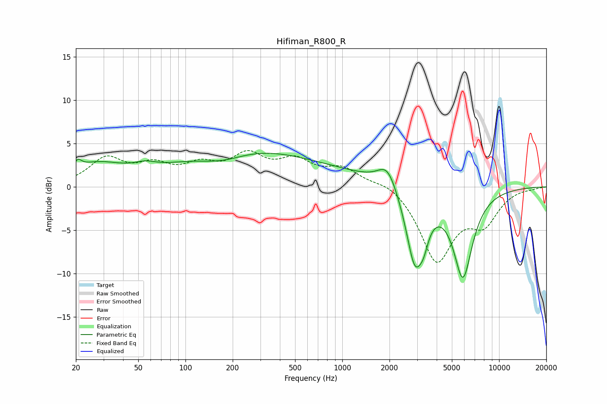

# Hifiman_R800_R
See [usage instructions](https://github.com/jaakkopasanen/AutoEq#usage) for more options and info.

### Parametric EQs
Apply preamp of -4.0 dB when using parametric equalizer.

|   # | Type    |   Fc (Hz) |    Q |   Gain (dB) |
|-----|---------|-----------|------|-------------|
|   1 | Peaking |        21 | 5.9  |         0.9 |
|   2 | Peaking |        27 | 0.85 |         2.2 |
|   3 | Peaking |        55 | 2.07 |         0.6 |
|   4 | Peaking |       172 | 0.96 |        -1.2 |
|   5 | Peaking |       183 | 0.35 |         3.3 |
|   6 | Peaking |       593 | 0.31 |         1.7 |
|   7 | Peaking |      1944 | 2.3  |         2.7 |
|   8 | Peaking |      2907 | 2.42 |        -8.9 |
|   9 | Peaking |      3308 | 4.86 |        -1.7 |
|  10 | Peaking |      5879 | 2.21 |       -10   |

### Fixed Band EQs
When using fixed band (also called graphic) equalizer, apply preamp of **-4.3 dB** (if available) and set gains manually with these parameters.

|   # | Type    |   Fc (Hz) |    Q |   Gain (dB) |
|-----|---------|-----------|------|-------------|
|   1 | Peaking |        31 | 1.41 |         3.1 |
|   2 | Peaking |        62 | 1.41 |         2.1 |
|   3 | Peaking |       125 | 1.41 |         2   |
|   4 | Peaking |       250 | 1.41 |         3.2 |
|   5 | Peaking |       500 | 1.41 |         2.6 |
|   6 | Peaking |      1000 | 1.41 |         1.9 |
|   7 | Peaking |      2000 | 1.41 |         0.9 |
|   8 | Peaking |      4000 | 1.41 |        -8.4 |
|   9 | Peaking |      8000 | 1.41 |        -3.6 |
|  10 | Peaking |     16000 | 1.41 |        -0.1 |

### Graphs

