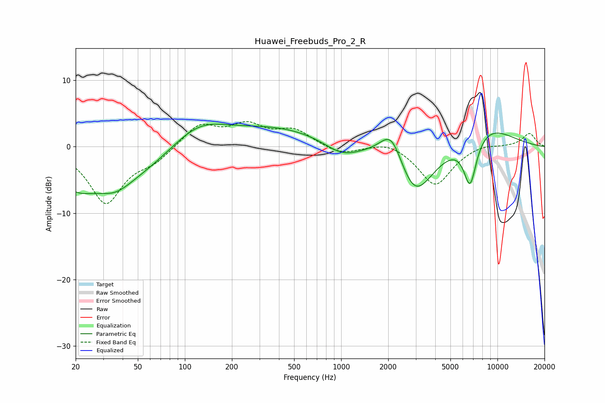

# Huawei_Freebuds_Pro_2_R
See [usage instructions](https://github.com/jaakkopasanen/AutoEq#usage) for more options and info.

### Parametric EQs
Apply preamp of -3.5 dB when using parametric equalizer.

|   # | Type    |   Fc (Hz) |    Q |   Gain (dB) |
|-----|---------|-----------|------|-------------|
|   1 | Peaking |        20 | 1.32 |        -2.3 |
|   2 | Peaking |        35 | 0.41 |        -5.5 |
|   3 | Peaking |        36 | 1.49 |        -1.5 |
|   4 | Peaking |       121 | 0.76 |         4.1 |
|   5 | Peaking |       400 | 0.46 |         2.7 |
|   6 | Peaking |      1010 | 1.26 |        -2   |
|   7 | Peaking |      2106 | 1.84 |         5.5 |
|   8 | Peaking |      2935 | 1.16 |        -8.5 |
|   9 | Peaking |      6684 | 3.2  |        -7.5 |
|  10 | Peaking |      8164 | 0.73 |         3.6 |

### Fixed Band EQs
When using fixed band (also called graphic) equalizer, apply preamp of **-3.9 dB** (if available) and set gains manually with these parameters.

|   # | Type    |   Fc (Hz) |    Q |   Gain (dB) |
|-----|---------|-----------|------|-------------|
|   1 | Peaking |        31 | 1.41 |        -8.4 |
|   2 | Peaking |        62 | 1.41 |        -1.8 |
|   3 | Peaking |       125 | 1.41 |         3.4 |
|   4 | Peaking |       250 | 1.41 |         2.9 |
|   5 | Peaking |       500 | 1.41 |         2.4 |
|   6 | Peaking |      1000 | 1.41 |        -1.2 |
|   7 | Peaking |      2000 | 1.41 |         1   |
|   8 | Peaking |      4000 | 1.41 |        -5.9 |
|   9 | Peaking |      8000 | 1.41 |         0.5 |
|  10 | Peaking |     16000 | 1.41 |         2   |

### Graphs

