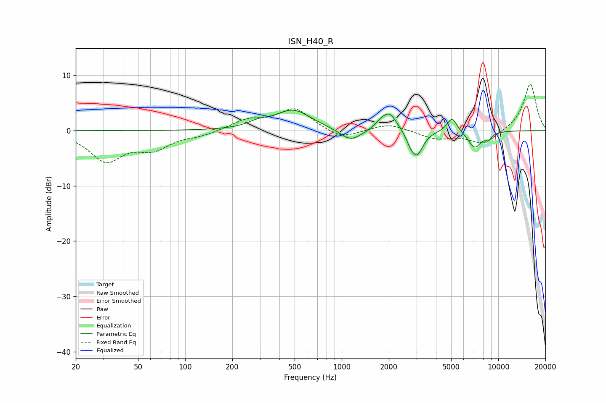

# ISN_H40_R
See [usage instructions](https://github.com/jaakkopasanen/AutoEq#usage) for more options and info.

### Parametric EQs
Apply preamp of -3.8 dB when using parametric equalizer.

|   # | Type    |   Fc (Hz) |    Q |   Gain (dB) |
|-----|---------|-----------|------|-------------|
|   1 | Peaking |       294 | 2.08 |         0.9 |
|   2 | Peaking |       491 | 1.25 |         3.6 |
|   3 | Peaking |      1142 | 2.09 |        -2.2 |
|   4 | Peaking |      1758 | 4.31 |         0.8 |
|   5 | Peaking |      2018 | 2.98 |         3.3 |
|   6 | Peaking |      2738 | 6    |        -1.1 |
|   7 | Peaking |      3025 | 3.63 |        -4.4 |
|   8 | Peaking |      5070 | 4.32 |         2.7 |
|   9 | Peaking |      7058 | 3.2  |        -3   |
|  10 | Peaking |      8651 | 5.48 |        -1   |

### Fixed Band EQs
When using fixed band (also called graphic) equalizer, apply preamp of **-8.5 dB** (if available) and set gains manually with these parameters.

|   # | Type    |   Fc (Hz) |    Q |   Gain (dB) |
|-----|---------|-----------|------|-------------|
|   1 | Peaking |        31 | 1.41 |        -5.3 |
|   2 | Peaking |        62 | 1.41 |        -2.9 |
|   3 | Peaking |       125 | 1.41 |        -0.8 |
|   4 | Peaking |       250 | 1.41 |         1.8 |
|   5 | Peaking |       500 | 1.41 |         3.9 |
|   6 | Peaking |      1000 | 1.41 |        -1.7 |
|   7 | Peaking |      2000 | 1.41 |         1.3 |
|   8 | Peaking |      4000 | 1.41 |        -1.4 |
|   9 | Peaking |      8000 | 1.41 |        -2.5 |
|  10 | Peaking |     16000 | 1.41 |         8.5 |

### Graphs

