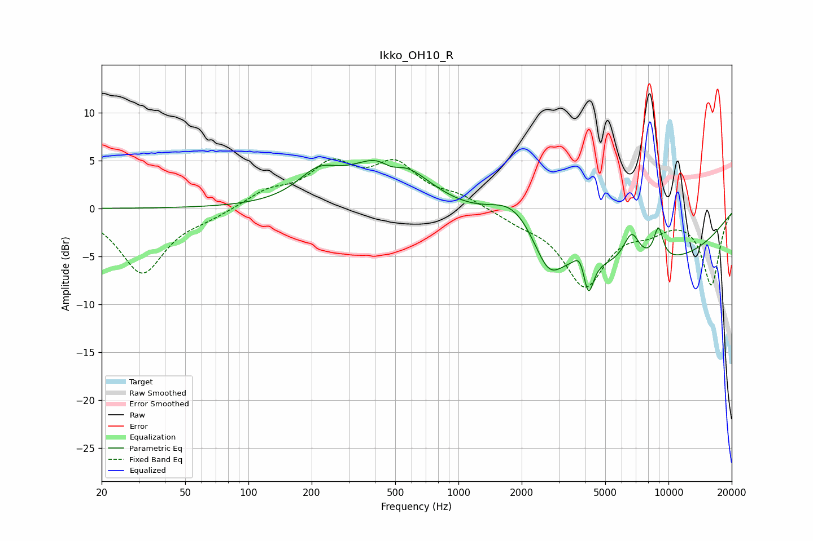

# Ikko_OH10_R
See [usage instructions](https://github.com/jaakkopasanen/AutoEq#usage) for more options and info.

### Parametric EQs
Apply preamp of -5.1 dB when using parametric equalizer.

|   # | Type    |   Fc (Hz) |    Q |   Gain (dB) |
|-----|---------|-----------|------|-------------|
|   1 | Peaking |       215 | 1.43 |         2.7 |
|   2 | Peaking |       470 | 0.93 |         6.3 |
|   3 | Peaking |       480 | 2.43 |        -1.9 |
|   4 | Peaking |      1840 | 1.16 |         3.8 |
|   5 | Peaking |      2683 | 2.09 |        -3.7 |
|   6 | Peaking |      3809 | 5.09 |         1.6 |
|   7 | Peaking |      4151 | 5.79 |        -3.9 |
|   8 | Peaking |      6241 | 0.24 |        -6.1 |
|   9 | Peaking |      6674 | 3.5  |         3.1 |
|  10 | Peaking |      8960 | 5.63 |         3.3 |

### Fixed Band EQs
When using fixed band (also called graphic) equalizer, apply preamp of **-5.3 dB** (if available) and set gains manually with these parameters.

|   # | Type    |   Fc (Hz) |    Q |   Gain (dB) |
|-----|---------|-----------|------|-------------|
|   1 | Peaking |        31 | 1.41 |        -6.7 |
|   2 | Peaking |        62 | 1.41 |        -0.7 |
|   3 | Peaking |       125 | 1.41 |         1.6 |
|   4 | Peaking |       250 | 1.41 |         4.1 |
|   5 | Peaking |       500 | 1.41 |         4.2 |
|   6 | Peaking |      1000 | 1.41 |         1.1 |
|   7 | Peaking |      2000 | 1.41 |        -1   |
|   8 | Peaking |      4000 | 1.41 |        -7.8 |
|   9 | Peaking |      8000 | 1.41 |        -1.6 |
|  10 | Peaking |     16000 | 1.41 |        -7.9 |

### Graphs

