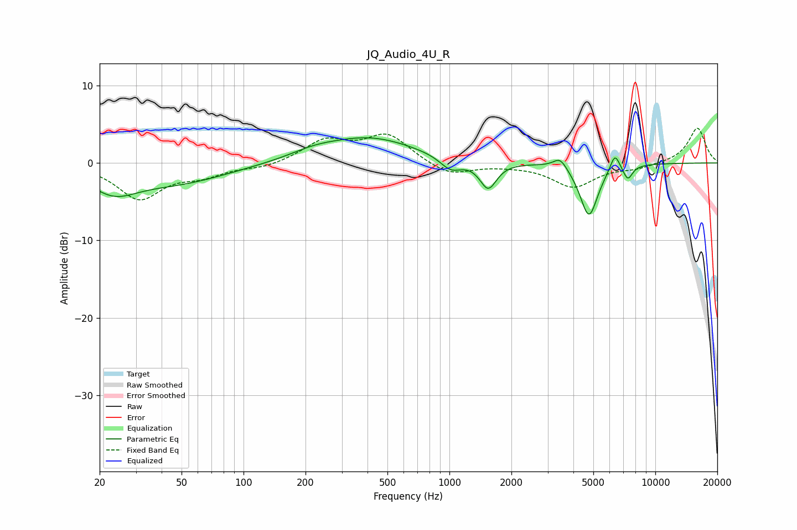

# JQ_Audio_4U_R
See [usage instructions](https://github.com/jaakkopasanen/AutoEq#usage) for more options and info.

### Parametric EQs
Apply preamp of -3.3 dB when using parametric equalizer.

|   # | Type    |   Fc (Hz) |    Q |   Gain (dB) |
|-----|---------|-----------|------|-------------|
|   1 | Peaking |        23 | 1.22 |        -2.9 |
|   2 | Peaking |        47 | 0.56 |        -2.4 |
|   3 | Peaking |       218 | 1.27 |         0.7 |
|   4 | Peaking |       406 | 0.62 |         3.2 |
|   5 | Peaking |      1015 | 2.72 |        -1.7 |
|   6 | Peaking |      1543 | 3.46 |        -3.5 |
|   7 | Peaking |      3450 | 4.29 |         1.5 |
|   8 | Peaking |      4761 | 3.2  |        -6.9 |
|   9 | Peaking |      6363 | 5.95 |         2.3 |
|  10 | Peaking |      7353 | 6    |        -1.8 |

### Fixed Band EQs
When using fixed band (also called graphic) equalizer, apply preamp of **-4.6 dB** (if available) and set gains manually with these parameters.

|   # | Type    |   Fc (Hz) |    Q |   Gain (dB) |
|-----|---------|-----------|------|-------------|
|   1 | Peaking |        31 | 1.41 |        -4.5 |
|   2 | Peaking |        62 | 1.41 |        -1.4 |
|   3 | Peaking |       125 | 1.41 |        -0.6 |
|   4 | Peaking |       250 | 1.41 |         2.8 |
|   5 | Peaking |       500 | 1.41 |         3.6 |
|   6 | Peaking |      1000 | 1.41 |        -1.7 |
|   7 | Peaking |      2000 | 1.41 |        -0.2 |
|   8 | Peaking |      4000 | 1.41 |        -3   |
|   9 | Peaking |      8000 | 1.41 |        -0.6 |
|  10 | Peaking |     16000 | 1.41 |         4.6 |

### Graphs

