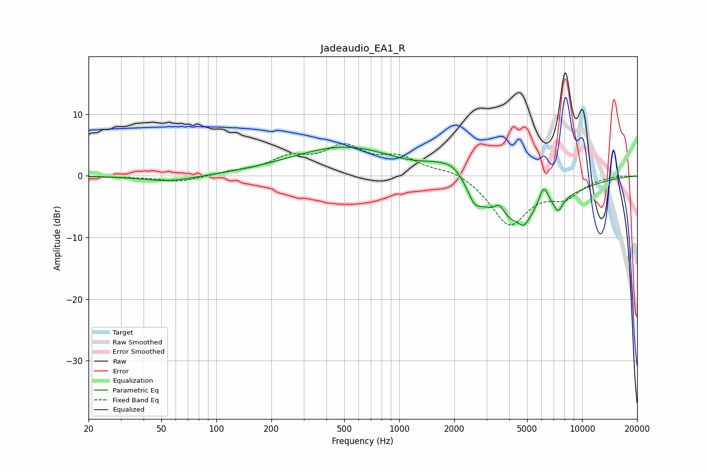

# Jadeaudio_EA1_R
See [usage instructions](https://github.com/jaakkopasanen/AutoEq#usage) for more options and info.

### Parametric EQs
Apply preamp of -4.8 dB when using parametric equalizer.

|   # | Type    |   Fc (Hz) |    Q |   Gain (dB) |
|-----|---------|-----------|------|-------------|
|   1 | Peaking |        56 | 0.99 |        -1   |
|   2 | Peaking |       512 | 0.48 |         4.8 |
|   3 | Peaking |      1548 | 1.55 |         1.3 |
|   4 | Peaking |      1995 | 1.86 |         3   |
|   5 | Peaking |      2575 | 4.12 |        -2.1 |
|   6 | Peaking |      3535 | 5.29 |         1.9 |
|   7 | Peaking |      4206 | 0.67 |        -8   |
|   8 | Peaking |      4799 | 5.94 |        -1.2 |
|   9 | Peaking |      6155 | 4.95 |         3.9 |
|  10 | Peaking |      7409 | 5.52 |        -2.1 |

### Fixed Band EQs
When using fixed band (also called graphic) equalizer, apply preamp of **-5.3 dB** (if available) and set gains manually with these parameters.

|   # | Type    |   Fc (Hz) |    Q |   Gain (dB) |
|-----|---------|-----------|------|-------------|
|   1 | Peaking |        31 | 1.41 |        -0.1 |
|   2 | Peaking |        62 | 1.41 |        -1   |
|   3 | Peaking |       125 | 1.41 |         0.5 |
|   4 | Peaking |       250 | 1.41 |         2.6 |
|   5 | Peaking |       500 | 1.41 |         4.3 |
|   6 | Peaking |      1000 | 1.41 |         2.7 |
|   7 | Peaking |      2000 | 1.41 |         1.2 |
|   8 | Peaking |      4000 | 1.41 |        -7.9 |
|   9 | Peaking |      8000 | 1.41 |        -2.9 |
|  10 | Peaking |     16000 | 1.41 |         0.1 |

### Graphs

