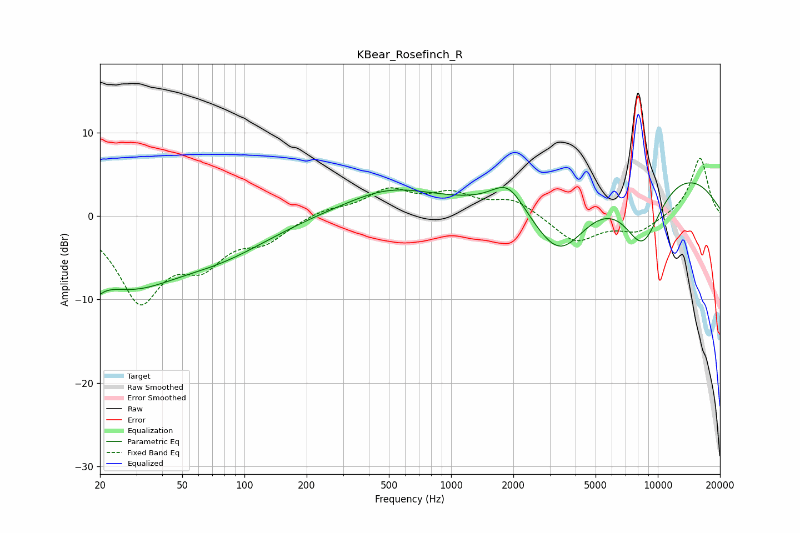

# KBear_Rosefinch_R
See [usage instructions](https://github.com/jaakkopasanen/AutoEq#usage) for more options and info.

### Parametric EQs
Apply preamp of -4.1 dB when using parametric equalizer.

|   # | Type    |   Fc (Hz) |    Q |   Gain (dB) |
|-----|---------|-----------|------|-------------|
|   1 | Peaking |        20 | 4.78 |        -5.6 |
|   2 | Peaking |        20 | 5.44 |         3.5 |
|   3 | Peaking |        27 | 0.58 |        -7.4 |
|   4 | Peaking |        78 | 0.56 |        -3.4 |
|   5 | Peaking |       495 | 0.77 |         1.6 |
|   6 | Peaking |       602 | 0.4  |         1.6 |
|   7 | Peaking |      1887 | 1.75 |         3.4 |
|   8 | Peaking |      3357 | 0.96 |        -8.7 |
|   9 | Peaking |      8335 | 0.26 |         7.2 |
|  10 | Peaking |      8431 | 1.29 |        -8.8 |

### Fixed Band EQs
When using fixed band (also called graphic) equalizer, apply preamp of **-7.0 dB** (if available) and set gains manually with these parameters.

|   # | Type    |   Fc (Hz) |    Q |   Gain (dB) |
|-----|---------|-----------|------|-------------|
|   1 | Peaking |        31 | 1.41 |        -9.7 |
|   2 | Peaking |        62 | 1.41 |        -4.6 |
|   3 | Peaking |       125 | 1.41 |        -2.5 |
|   4 | Peaking |       250 | 1.41 |         0.8 |
|   5 | Peaking |       500 | 1.41 |         2.9 |
|   6 | Peaking |      1000 | 1.41 |         2.3 |
|   7 | Peaking |      2000 | 1.41 |         1.9 |
|   8 | Peaking |      4000 | 1.41 |        -3.2 |
|   9 | Peaking |      8000 | 1.41 |        -1.9 |
|  10 | Peaking |     16000 | 1.41 |         7.1 |

### Graphs

