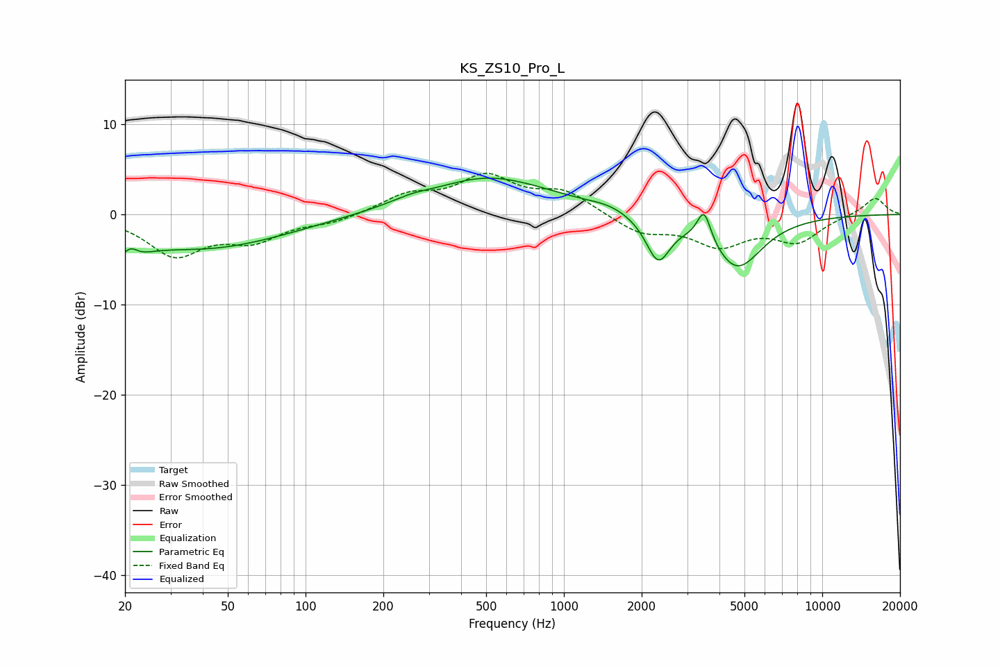

# KS_ZS10_Pro_L
See [usage instructions](https://github.com/jaakkopasanen/AutoEq#usage) for more options and info.

### Parametric EQs
Apply preamp of -4.1 dB when using parametric equalizer.

|   # | Type    |   Fc (Hz) |    Q |   Gain (dB) |
|-----|---------|-----------|------|-------------|
|   1 | Peaking |        20 | 2.38 |        -3.7 |
|   2 | Peaking |        21 | 4.5  |         2.3 |
|   3 | Peaking |        41 | 0.44 |        -3.7 |
|   4 | Peaking |       258 | 1.72 |         0.6 |
|   5 | Peaking |       292 | 0.94 |        -0.6 |
|   6 | Peaking |       491 | 0.56 |         4.4 |
|   7 | Peaking |      1491 | 1.85 |         0.5 |
|   8 | Peaking |      2315 | 3    |        -4.9 |
|   9 | Peaking |      3488 | 5.38 |         3.5 |
|  10 | Peaking |      4682 | 1.44 |        -5.9 |

### Fixed Band EQs
When using fixed band (also called graphic) equalizer, apply preamp of **-4.7 dB** (if available) and set gains manually with these parameters.

|   # | Type    |   Fc (Hz) |    Q |   Gain (dB) |
|-----|---------|-----------|------|-------------|
|   1 | Peaking |        31 | 1.41 |        -4.3 |
|   2 | Peaking |        62 | 1.41 |        -2.5 |
|   3 | Peaking |       125 | 1.41 |        -0.8 |
|   4 | Peaking |       250 | 1.41 |         2   |
|   5 | Peaking |       500 | 1.41 |         3.9 |
|   6 | Peaking |      1000 | 1.41 |         2.4 |
|   7 | Peaking |      2000 | 1.41 |        -2   |
|   8 | Peaking |      4000 | 1.41 |        -3.2 |
|   9 | Peaking |      8000 | 1.41 |        -2.8 |
|  10 | Peaking |     16000 | 1.41 |         1.9 |

### Graphs

