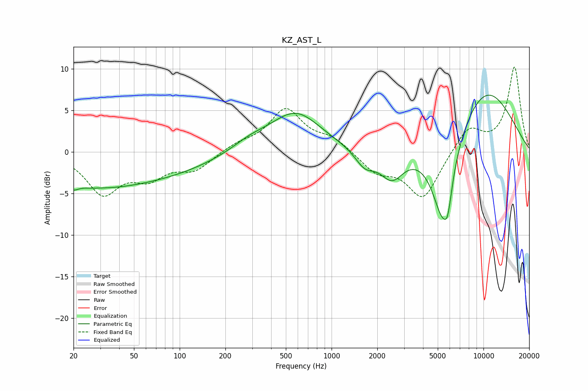

# KZ_AST_L
See [usage instructions](https://github.com/jaakkopasanen/AutoEq#usage) for more options and info.

### Parametric EQs
Apply preamp of -6.9 dB when using parametric equalizer.

|   # | Type    |   Fc (Hz) |    Q |   Gain (dB) |
|-----|---------|-----------|------|-------------|
|   1 | Peaking |        20 | 5.12 |        -0.5 |
|   2 | Peaking |        25 | 0.35 |        -3.9 |
|   3 | Peaking |       101 | 0.48 |        -1.4 |
|   4 | Peaking |       289 | 1.16 |         1.1 |
|   5 | Peaking |       579 | 0.84 |         4.7 |
|   6 | Peaking |      1654 | 2.16 |        -2   |
|   7 | Peaking |      2497 | 1.8  |        -3.4 |
|   8 | Peaking |      5394 | 1.75 |       -10.8 |
|   9 | Peaking |      5825 | 5.61 |        -2.6 |
|  10 | Peaking |     10000 | 0.53 |         8   |

### Fixed Band EQs
When using fixed band (also called graphic) equalizer, apply preamp of **-10.3 dB** (if available) and set gains manually with these parameters.

|   # | Type    |   Fc (Hz) |    Q |   Gain (dB) |
|-----|---------|-----------|------|-------------|
|   1 | Peaking |        31 | 1.41 |        -4.8 |
|   2 | Peaking |        62 | 1.41 |        -2.6 |
|   3 | Peaking |       125 | 1.41 |        -2   |
|   4 | Peaking |       250 | 1.41 |         0.9 |
|   5 | Peaking |       500 | 1.41 |         5   |
|   6 | Peaking |      1000 | 1.41 |         1.5 |
|   7 | Peaking |      2000 | 1.41 |        -2.3 |
|   8 | Peaking |      4000 | 1.41 |        -5.6 |
|   9 | Peaking |      8000 | 1.41 |         3   |
|  10 | Peaking |     16000 | 1.41 |        10.2 |

### Graphs

