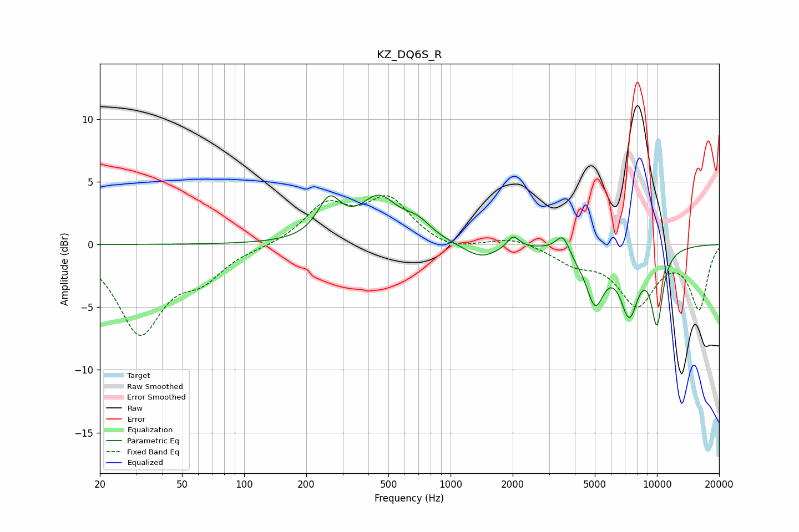

# KZ_DQ6S_R
See [usage instructions](https://github.com/jaakkopasanen/AutoEq#usage) for more options and info.

### Parametric EQs
Apply preamp of -4.0 dB when using parametric equalizer.

|   # | Type    |   Fc (Hz) |    Q |   Gain (dB) |
|-----|---------|-----------|------|-------------|
|   1 | Peaking |       259 | 2.48 |         3   |
|   2 | Peaking |       449 | 1.55 |         3.4 |
|   3 | Peaking |       688 | 2.03 |         1.2 |
|   4 | Peaking |      1400 | 1.66 |        -1.2 |
|   5 | Peaking |      2009 | 4.88 |         1   |
|   6 | Peaking |      3503 | 4.3  |         1.5 |
|   7 | Peaking |      4039 | 4.12 |        -0.3 |
|   8 | Peaking |      5013 | 3.11 |        -4.2 |
|   9 | Peaking |      7342 | 2.97 |        -4.9 |
|  10 | Peaking |     10000 | 4.31 |        -5.6 |

### Fixed Band EQs
When using fixed band (also called graphic) equalizer, apply preamp of **-4.0 dB** (if available) and set gains manually with these parameters.

|   # | Type    |   Fc (Hz) |    Q |   Gain (dB) |
|-----|---------|-----------|------|-------------|
|   1 | Peaking |        31 | 1.41 |        -6.9 |
|   2 | Peaking |        62 | 1.41 |        -2.2 |
|   3 | Peaking |       125 | 1.41 |        -0.2 |
|   4 | Peaking |       250 | 1.41 |         3   |
|   5 | Peaking |       500 | 1.41 |         3.5 |
|   6 | Peaking |      1000 | 1.41 |        -0.6 |
|   7 | Peaking |      2000 | 1.41 |         0.6 |
|   8 | Peaking |      4000 | 1.41 |        -1.3 |
|   9 | Peaking |      8000 | 1.41 |        -4.6 |
|  10 | Peaking |     16000 | 1.41 |        -5   |

### Graphs

