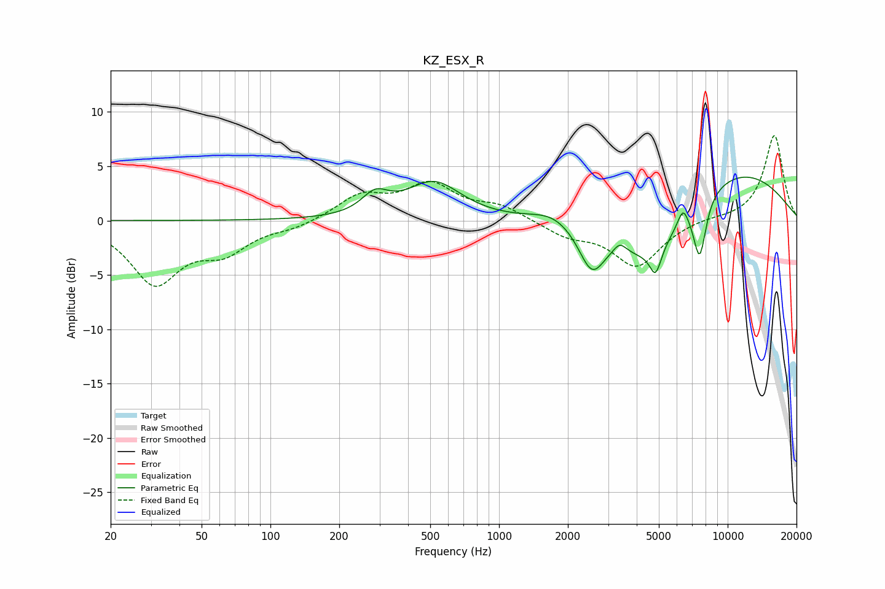

# KZ_ESX_R
See [usage instructions](https://github.com/jaakkopasanen/AutoEq#usage) for more options and info.

### Parametric EQs
Apply preamp of -4.1 dB when using parametric equalizer.

|   # | Type    |   Fc (Hz) |    Q |   Gain (dB) |
|-----|---------|-----------|------|-------------|
|   1 | Peaking |       287 | 2.43 |         1.8 |
|   2 | Peaking |       519 | 1.19 |         3.4 |
|   3 | Peaking |      1723 | 1.51 |         1   |
|   4 | Peaking |      2548 | 2.42 |        -4.1 |
|   5 | Peaking |      3374 | 5.17 |         0.9 |
|   6 | Peaking |      4607 | 0.92 |        -5.3 |
|   7 | Peaking |      4837 | 5.66 |        -2.4 |
|   8 | Peaking |      6380 | 5.83 |         1.7 |
|   9 | Peaking |      7544 | 4.78 |        -5.4 |
|  10 | Peaking |     10000 | 0.39 |         5   |

### Fixed Band EQs
When using fixed band (also called graphic) equalizer, apply preamp of **-7.9 dB** (if available) and set gains manually with these parameters.

|   # | Type    |   Fc (Hz) |    Q |   Gain (dB) |
|-----|---------|-----------|------|-------------|
|   1 | Peaking |        31 | 1.41 |        -5.6 |
|   2 | Peaking |        62 | 1.41 |        -2.5 |
|   3 | Peaking |       125 | 1.41 |        -0.6 |
|   4 | Peaking |       250 | 1.41 |         2.2 |
|   5 | Peaking |       500 | 1.41 |         3.1 |
|   6 | Peaking |      1000 | 1.41 |         1.2 |
|   7 | Peaking |      2000 | 1.41 |        -1.3 |
|   8 | Peaking |      4000 | 1.41 |        -4.2 |
|   9 | Peaking |      8000 | 1.41 |         0.2 |
|  10 | Peaking |     16000 | 1.41 |         7.9 |

### Graphs

