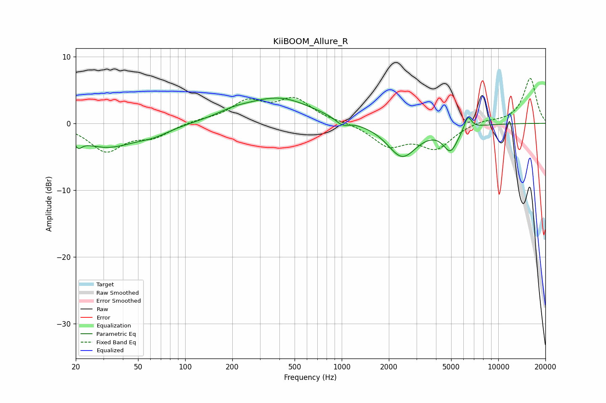

# KiiBOOM_Allure_R
See [usage instructions](https://github.com/jaakkopasanen/AutoEq#usage) for more options and info.

### Parametric EQs
Apply preamp of -3.9 dB when using parametric equalizer.

|   # | Type    |   Fc (Hz) |    Q |   Gain (dB) |
|-----|---------|-----------|------|-------------|
|   1 | Peaking |        21 | 5.99 |        -3.7 |
|   2 | Peaking |        21 | 6    |         2.4 |
|   3 | Peaking |        31 | 0.71 |        -3.5 |
|   4 | Peaking |        64 | 1.4  |        -0.8 |
|   5 | Peaking |       204 | 1.29 |         0.8 |
|   6 | Peaking |       397 | 0.65 |         3.7 |
|   7 | Peaking |      1006 | 3.37 |        -1   |
|   8 | Peaking |      2434 | 1.48 |        -5   |
|   9 | Peaking |      4956 | 2.92 |        -3.5 |
|  10 | Peaking |      6395 | 6    |         2.1 |

### Fixed Band EQs
When using fixed band (also called graphic) equalizer, apply preamp of **-6.8 dB** (if available) and set gains manually with these parameters.

|   # | Type    |   Fc (Hz) |    Q |   Gain (dB) |
|-----|---------|-----------|------|-------------|
|   1 | Peaking |        31 | 1.41 |        -4   |
|   2 | Peaking |        62 | 1.41 |        -1.8 |
|   3 | Peaking |       125 | 1.41 |         0.4 |
|   4 | Peaking |       250 | 1.41 |         3   |
|   5 | Peaking |       500 | 1.41 |         3.4 |
|   6 | Peaking |      1000 | 1.41 |         0.2 |
|   7 | Peaking |      2000 | 1.41 |        -3.2 |
|   8 | Peaking |      4000 | 1.41 |        -3.5 |
|   9 | Peaking |      8000 | 1.41 |         0.5 |
|  10 | Peaking |     16000 | 1.41 |         6.8 |

### Graphs

