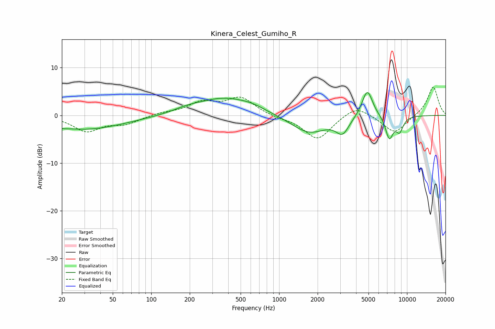

# Kinera_Celest_Gumiho_R
See [usage instructions](https://github.com/jaakkopasanen/AutoEq#usage) for more options and info.

### Parametric EQs
Apply preamp of -4.9 dB when using parametric equalizer.

|   # | Type    |   Fc (Hz) |    Q |   Gain (dB) |
|-----|---------|-----------|------|-------------|
|   1 | Peaking |        20 | 3.94 |        -0.2 |
|   2 | Peaking |        30 | 0.45 |        -2.9 |
|   3 | Peaking |       190 | 1.38 |         0.7 |
|   4 | Peaking |       368 | 0.69 |         3.5 |
|   5 | Peaking |       617 | 1.33 |         0.8 |
|   6 | Peaking |      1714 | 1.03 |        -3.8 |
|   7 | Peaking |      3132 | 2.8  |        -3.2 |
|   8 | Peaking |      4892 | 3.26 |         5.9 |
|   9 | Peaking |      7271 | 4.43 |        -4.7 |
|  10 | Peaking |      8750 | 4.45 |        -3   |

### Fixed Band EQs
When using fixed band (also called graphic) equalizer, apply preamp of **-6.0 dB** (if available) and set gains manually with these parameters.

|   # | Type    |   Fc (Hz) |    Q |   Gain (dB) |
|-----|---------|-----------|------|-------------|
|   1 | Peaking |        31 | 1.41 |        -3.2 |
|   2 | Peaking |        62 | 1.41 |        -1.6 |
|   3 | Peaking |       125 | 1.41 |         0.5 |
|   4 | Peaking |       250 | 1.41 |         2.5 |
|   5 | Peaking |       500 | 1.41 |         3.6 |
|   6 | Peaking |      1000 | 1.41 |        -0.4 |
|   7 | Peaking |      2000 | 1.41 |        -5.1 |
|   8 | Peaking |      4000 | 1.41 |         2.3 |
|   9 | Peaking |      8000 | 1.41 |        -3.8 |
|  10 | Peaking |     16000 | 1.41 |         6.1 |

### Graphs

