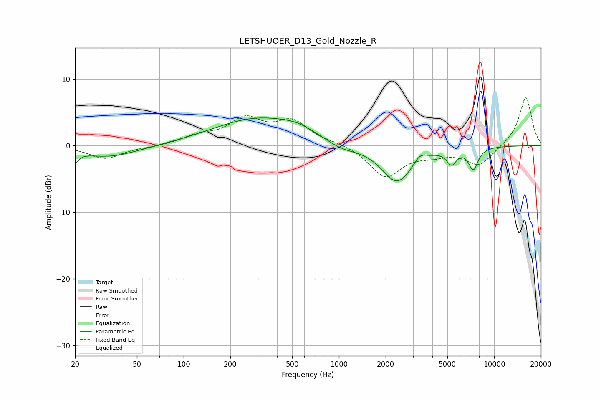

# LETSHUOER_D13_Gold_Nozzle_R
See [usage instructions](https://github.com/jaakkopasanen/AutoEq#usage) for more options and info.

### Parametric EQs
Apply preamp of -4.2 dB when using parametric equalizer.

|   # | Type    |   Fc (Hz) |    Q |   Gain (dB) |
|-----|---------|-----------|------|-------------|
|   1 | Peaking |        20 | 6    |        -1.6 |
|   2 | Peaking |        33 | 0.75 |        -1.7 |
|   3 | Peaking |       307 | 0.48 |         4.1 |
|   4 | Peaking |       543 | 1.44 |         0.7 |
|   5 | Peaking |      1041 | 1.4  |        -1.1 |
|   6 | Peaking |      2364 | 1.43 |        -5.5 |
|   7 | Peaking |      3326 | 3.92 |         1.1 |
|   8 | Peaking |      5316 | 4.44 |        -2.1 |
|   9 | Peaking |      7335 | 4.42 |        -3.1 |
|  10 | Peaking |      7547 | 3.86 |        -0.1 |

### Fixed Band EQs
When using fixed band (also called graphic) equalizer, apply preamp of **-7.3 dB** (if available) and set gains manually with these parameters.

|   # | Type    |   Fc (Hz) |    Q |   Gain (dB) |
|-----|---------|-----------|------|-------------|
|   1 | Peaking |        31 | 1.41 |        -1.9 |
|   2 | Peaking |        62 | 1.41 |        -0.2 |
|   3 | Peaking |       125 | 1.41 |         1.3 |
|   4 | Peaking |       250 | 1.41 |         3.7 |
|   5 | Peaking |       500 | 1.41 |         3.4 |
|   6 | Peaking |      1000 | 1.41 |         0.4 |
|   7 | Peaking |      2000 | 1.41 |        -4.6 |
|   8 | Peaking |      4000 | 1.41 |        -1   |
|   9 | Peaking |      8000 | 1.41 |        -2.9 |
|  10 | Peaking |     16000 | 1.41 |         7.4 |

### Graphs

