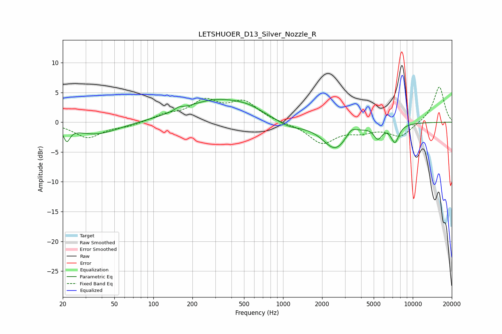

# LETSHUOER_D13_Silver_Nozzle_R
See [usage instructions](https://github.com/jaakkopasanen/AutoEq#usage) for more options and info.

### Parametric EQs
Apply preamp of -3.9 dB when using parametric equalizer.

|   # | Type    |   Fc (Hz) |    Q |   Gain (dB) |
|-----|---------|-----------|------|-------------|
|   1 | Peaking |        21 | 5.99 |        -2.2 |
|   2 | Peaking |        36 | 0.83 |        -2.1 |
|   3 | Peaking |       157 | 4.65 |         0.5 |
|   4 | Peaking |       314 | 0.55 |         3.8 |
|   5 | Peaking |       541 | 1.39 |         0.6 |
|   6 | Peaking |      1113 | 1.36 |        -1.1 |
|   7 | Peaking |      2529 | 1.44 |        -4.5 |
|   8 | Peaking |      3353 | 3.62 |         1.3 |
|   9 | Peaking |      5380 | 4.45 |        -2.1 |
|  10 | Peaking |      7288 | 4.27 |        -3   |

### Fixed Band EQs
When using fixed band (also called graphic) equalizer, apply preamp of **-6.0 dB** (if available) and set gains manually with these parameters.

|   # | Type    |   Fc (Hz) |    Q |   Gain (dB) |
|-----|---------|-----------|------|-------------|
|   1 | Peaking |        31 | 1.41 |        -2.6 |
|   2 | Peaking |        62 | 1.41 |        -0.6 |
|   3 | Peaking |       125 | 1.41 |         1   |
|   4 | Peaking |       250 | 1.41 |         3.3 |
|   5 | Peaking |       500 | 1.41 |         3.2 |
|   6 | Peaking |      1000 | 1.41 |        -0.1 |
|   7 | Peaking |      2000 | 1.41 |        -3.4 |
|   8 | Peaking |      4000 | 1.41 |        -1.3 |
|   9 | Peaking |      8000 | 1.41 |        -2.4 |
|  10 | Peaking |     16000 | 1.41 |         6.1 |

### Graphs

