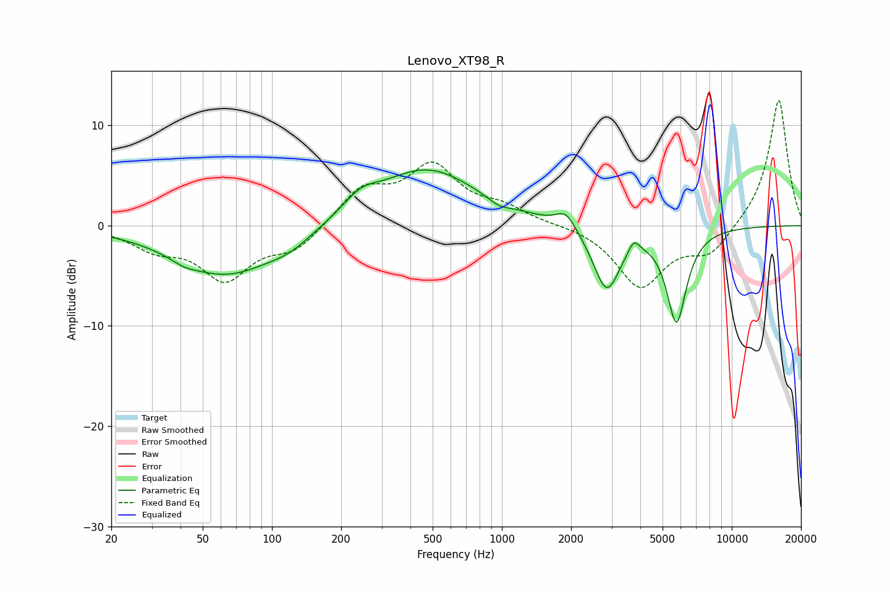

# Lenovo_XT98_R
See [usage instructions](https://github.com/jaakkopasanen/AutoEq#usage) for more options and info.

### Parametric EQs
Apply preamp of -5.7 dB when using parametric equalizer.

|   # | Type    |   Fc (Hz) |    Q |   Gain (dB) |
|-----|---------|-----------|------|-------------|
|   1 | Peaking |        41 | 2.63 |        -0.5 |
|   2 | Peaking |        63 | 0.64 |        -4.9 |
|   3 | Peaking |       119 | 1.53 |        -1   |
|   4 | Peaking |       242 | 1.86 |         1.6 |
|   5 | Peaking |       470 | 0.64 |         5.7 |
|   6 | Peaking |       973 | 2.98 |        -0.6 |
|   7 | Peaking |      1899 | 3.34 |         1.6 |
|   8 | Peaking |      2855 | 2.38 |        -6.4 |
|   9 | Peaking |      3746 | 6    |         1.3 |
|  10 | Peaking |      5748 | 3.17 |        -9.4 |

### Fixed Band EQs
When using fixed band (also called graphic) equalizer, apply preamp of **-12.6 dB** (if available) and set gains manually with these parameters.

|   # | Type    |   Fc (Hz) |    Q |   Gain (dB) |
|-----|---------|-----------|------|-------------|
|   1 | Peaking |        31 | 1.41 |        -2   |
|   2 | Peaking |        62 | 1.41 |        -5.1 |
|   3 | Peaking |       125 | 1.41 |        -2.3 |
|   4 | Peaking |       250 | 1.41 |         3.5 |
|   5 | Peaking |       500 | 1.41 |         5.6 |
|   6 | Peaking |      1000 | 1.41 |         1.5 |
|   7 | Peaking |      2000 | 1.41 |         0.1 |
|   8 | Peaking |      4000 | 1.41 |        -6.1 |
|   9 | Peaking |      8000 | 1.41 |        -2.7 |
|  10 | Peaking |     16000 | 1.41 |        12.8 |

### Graphs

