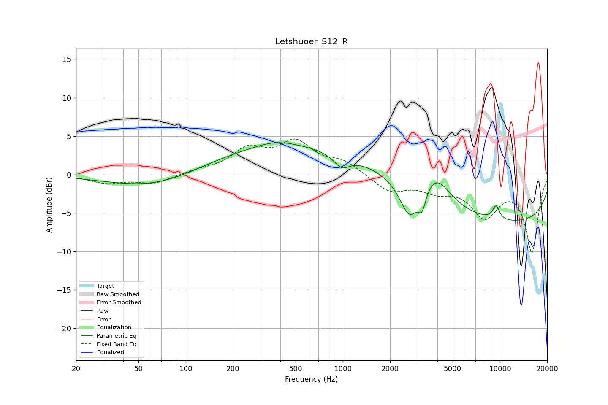

# Letshuoer_S12_R
See [usage instructions](https://github.com/jaakkopasanen/AutoEq#usage) for more options and info.

### Parametric EQs
Apply preamp of -4.3 dB when using parametric equalizer.

|   # | Type    |   Fc (Hz) |    Q |   Gain (dB) |
|-----|---------|-----------|------|-------------|
|   1 | Peaking |        70 | 0.48 |        -2.3 |
|   2 | Peaking |       376 | 1.09 |         0.9 |
|   3 | Peaking |       500 | 0.18 |         3.9 |
|   4 | Peaking |       983 | 2.81 |        -1.7 |
|   5 | Peaking |      2653 | 2.39 |        -4.6 |
|   6 | Peaking |      3200 | 5.97 |        -2.4 |
|   7 | Peaking |      3855 | 1.23 |         2.8 |
|   8 | Peaking |      3965 | 2.18 |         1.2 |
|   9 | Peaking |      9450 | 5.63 |         1.8 |
|  10 | Peaking |     10000 | 0.18 |        -6.3 |

### Fixed Band EQs
When using fixed band (also called graphic) equalizer, apply preamp of **-4.7 dB** (if available) and set gains manually with these parameters.

|   # | Type    |   Fc (Hz) |    Q |   Gain (dB) |
|-----|---------|-----------|------|-------------|
|   1 | Peaking |        31 | 1.41 |        -1   |
|   2 | Peaking |        62 | 1.41 |        -1.1 |
|   3 | Peaking |       125 | 1.41 |         0.4 |
|   4 | Peaking |       250 | 1.41 |         3   |
|   5 | Peaking |       500 | 1.41 |         3.9 |
|   6 | Peaking |      1000 | 1.41 |         1.6 |
|   7 | Peaking |      2000 | 1.41 |        -2.1 |
|   8 | Peaking |      4000 | 1.41 |        -1.7 |
|   9 | Peaking |      8000 | 1.41 |        -5   |
|  10 | Peaking |     16000 | 1.41 |        -9.9 |

### Graphs

