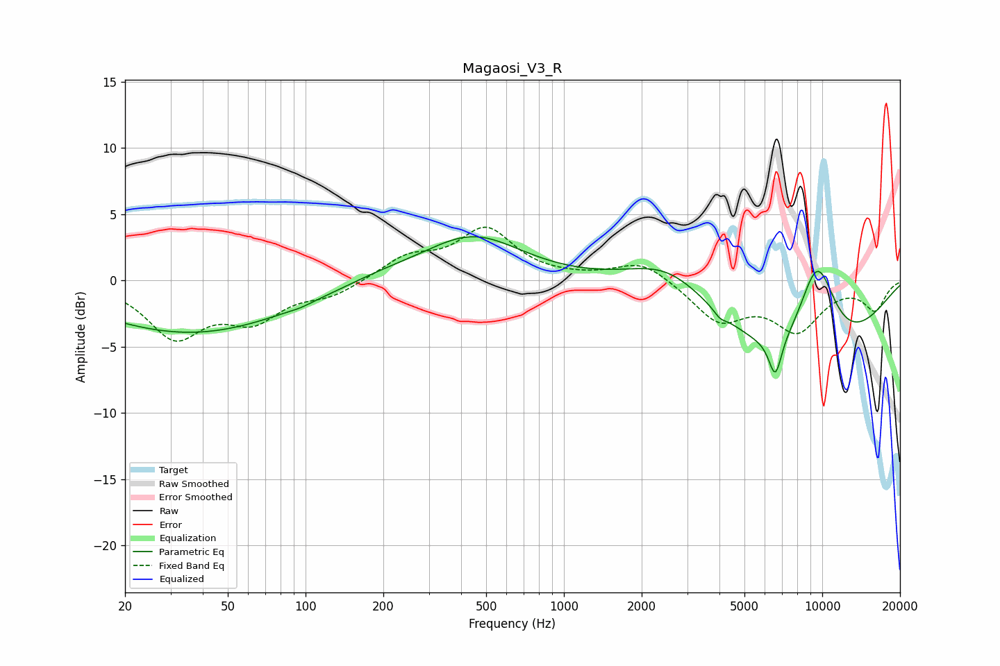

# Magaosi_V3_R
See [usage instructions](https://github.com/jaakkopasanen/AutoEq#usage) for more options and info.

### Parametric EQs
Apply preamp of -3.4 dB when using parametric equalizer.

|   # | Type    |   Fc (Hz) |    Q |   Gain (dB) |
|-----|---------|-----------|------|-------------|
|   1 | Peaking |        34 | 0.38 |        -3.5 |
|   2 | Peaking |        95 | 3.42 |        -0.1 |
|   3 | Peaking |       144 | 0.18 |        -0.8 |
|   4 | Peaking |       191 | 0.81 |         0.8 |
|   5 | Peaking |       442 | 0.72 |         3.8 |
|   6 | Peaking |      2540 | 0.9  |         2.5 |
|   7 | Peaking |      4019 | 5.94 |        -0.4 |
|   8 | Peaking |      6582 | 5.43 |        -2.9 |
|   9 | Peaking |      8516 | 0.44 |        -7.7 |
|  10 | Peaking |      9538 | 1.53 |         8.2 |

### Fixed Band EQs
When using fixed band (also called graphic) equalizer, apply preamp of **-4.1 dB** (if available) and set gains manually with these parameters.

|   # | Type    |   Fc (Hz) |    Q |   Gain (dB) |
|-----|---------|-----------|------|-------------|
|   1 | Peaking |        31 | 1.41 |        -4.1 |
|   2 | Peaking |        62 | 1.41 |        -2.6 |
|   3 | Peaking |       125 | 1.41 |        -1   |
|   4 | Peaking |       250 | 1.41 |         1.6 |
|   5 | Peaking |       500 | 1.41 |         3.7 |
|   6 | Peaking |      1000 | 1.41 |         0.1 |
|   7 | Peaking |      2000 | 1.41 |         1.5 |
|   8 | Peaking |      4000 | 1.41 |        -2.9 |
|   9 | Peaking |      8000 | 1.41 |        -3.5 |
|  10 | Peaking |     16000 | 1.41 |        -2.1 |

### Graphs

