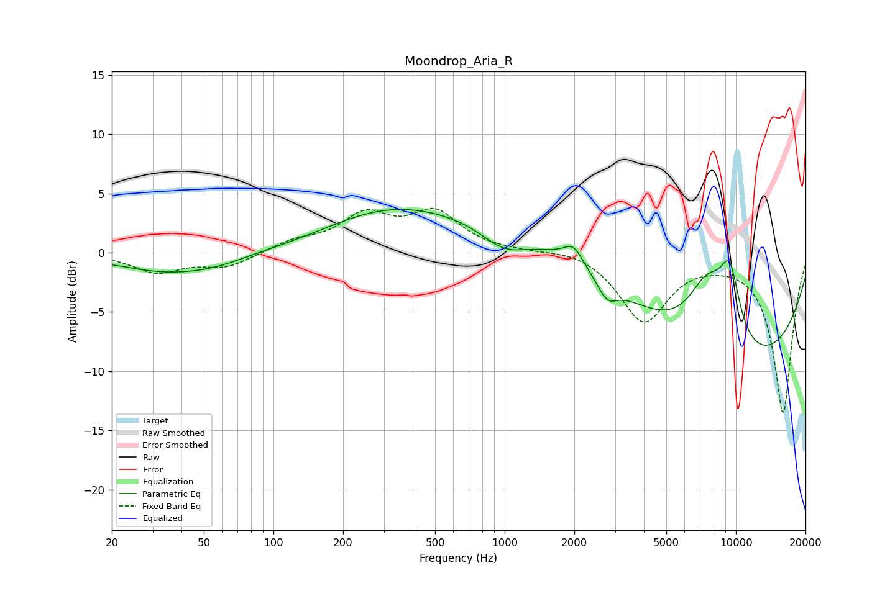

# Moondrop_Aria_R
See [usage instructions](https://github.com/jaakkopasanen/AutoEq#usage) for more options and info.

### Parametric EQs
Apply preamp of -3.7 dB when using parametric equalizer.

|   # | Type    |   Fc (Hz) |    Q |   Gain (dB) |
|-----|---------|-----------|------|-------------|
|   1 | Peaking |        36 | 0.62 |        -1.7 |
|   2 | Peaking |        58 | 1.18 |        -0.3 |
|   3 | Peaking |       283 | 0.58 |         1.6 |
|   4 | Peaking |       995 | 1.33 |        -2   |
|   5 | Peaking |      1079 | 0.21 |         3.4 |
|   6 | Peaking |      1981 | 3.31 |         1.5 |
|   7 | Peaking |      2772 | 3.26 |        -1.6 |
|   8 | Peaking |      7531 | 1.49 |         5.7 |
|   9 | Peaking |      9287 | 0.24 |       -10.1 |
|  10 | Peaking |      9410 | 2.84 |         5.5 |

### Fixed Band EQs
When using fixed band (also called graphic) equalizer, apply preamp of **-3.8 dB** (if available) and set gains manually with these parameters.

|   # | Type    |   Fc (Hz) |    Q |   Gain (dB) |
|-----|---------|-----------|------|-------------|
|   1 | Peaking |        31 | 1.41 |        -1.6 |
|   2 | Peaking |        62 | 1.41 |        -1.2 |
|   3 | Peaking |       125 | 1.41 |         0.9 |
|   4 | Peaking |       250 | 1.41 |         2.9 |
|   5 | Peaking |       500 | 1.41 |         3.2 |
|   6 | Peaking |      1000 | 1.41 |         0.1 |
|   7 | Peaking |      2000 | 1.41 |         0.4 |
|   8 | Peaking |      4000 | 1.41 |        -5.8 |
|   9 | Peaking |      8000 | 1.41 |        -0.2 |
|  10 | Peaking |     16000 | 1.41 |       -13.5 |

### Graphs

