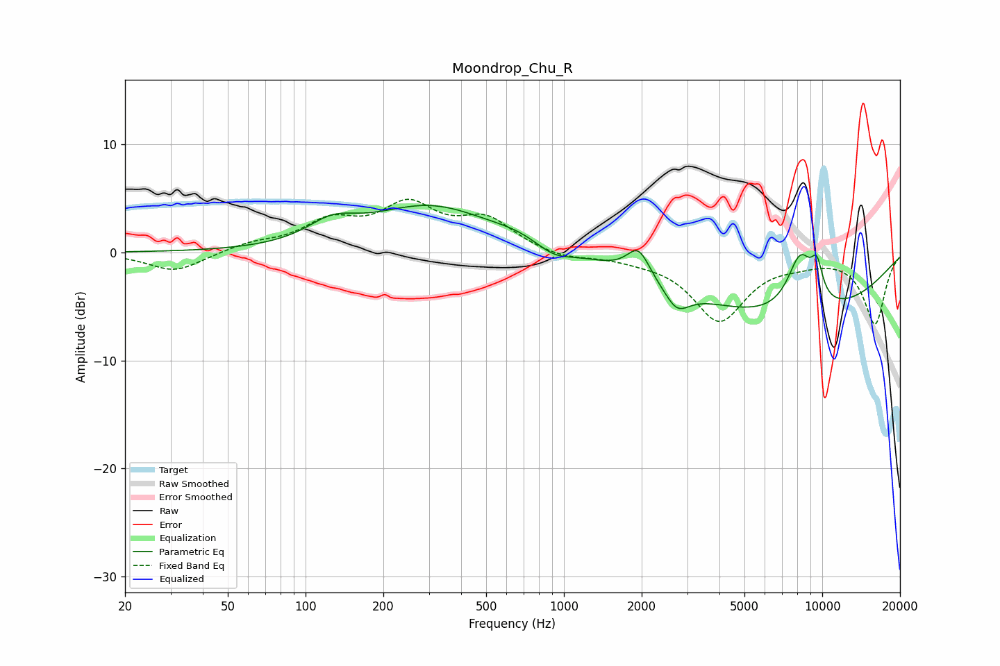

# Moondrop_Chu_R
See [usage instructions](https://github.com/jaakkopasanen/AutoEq#usage) for more options and info.

### Parametric EQs
Apply preamp of -4.5 dB when using parametric equalizer.

|   # | Type    |   Fc (Hz) |    Q |   Gain (dB) |
|-----|---------|-----------|------|-------------|
|   1 | Peaking |       127 | 1.5  |         1.7 |
|   2 | Peaking |       304 | 0.6  |         4.2 |
|   3 | Peaking |       666 | 1.37 |         0.6 |
|   4 | Peaking |       913 | 2.04 |        -1   |
|   5 | Peaking |      1944 | 3.21 |         2.7 |
|   6 | Peaking |      2526 | 6    |         0.1 |
|   7 | Peaking |      2722 | 2.84 |        -2.2 |
|   8 | Peaking |      7477 | 0.31 |        -6.1 |
|   9 | Peaking |      8229 | 2.52 |         5.3 |
|  10 | Peaking |      9537 | 5.63 |         2.8 |

### Fixed Band EQs
When using fixed band (also called graphic) equalizer, apply preamp of **-5.0 dB** (if available) and set gains manually with these parameters.

|   # | Type    |   Fc (Hz) |    Q |   Gain (dB) |
|-----|---------|-----------|------|-------------|
|   1 | Peaking |        31 | 1.41 |        -1.8 |
|   2 | Peaking |        62 | 1.41 |         0.7 |
|   3 | Peaking |       125 | 1.41 |         2.6 |
|   4 | Peaking |       250 | 1.41 |         4   |
|   5 | Peaking |       500 | 1.41 |         2.8 |
|   6 | Peaking |      1000 | 1.41 |        -0.6 |
|   7 | Peaking |      2000 | 1.41 |        -0.4 |
|   8 | Peaking |      4000 | 1.41 |        -6.2 |
|   9 | Peaking |      8000 | 1.41 |        -0.6 |
|  10 | Peaking |     16000 | 1.41 |        -6.6 |

### Graphs

