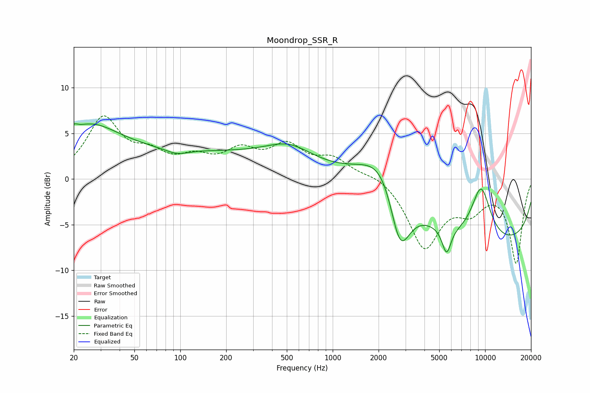

# Moondrop_SSR_R
See [usage instructions](https://github.com/jaakkopasanen/AutoEq#usage) for more options and info.

### Parametric EQs
Apply preamp of -6.1 dB when using parametric equalizer.

|   # | Type    |   Fc (Hz) |    Q |   Gain (dB) |
|-----|---------|-----------|------|-------------|
|   1 | Peaking |        20 | 5.96 |         0.7 |
|   2 | Peaking |        24 | 0.69 |         4.7 |
|   3 | Peaking |        95 | 1.87 |        -0.6 |
|   4 | Peaking |       149 | 0.2  |         2.8 |
|   5 | Peaking |       518 | 0.97 |         1.7 |
|   6 | Peaking |      2308 | 0.89 |         7.8 |
|   7 | Peaking |      2749 | 1.82 |        -9.2 |
|   8 | Peaking |      5586 | 4.69 |        -2.9 |
|   9 | Peaking |      9401 | 1.93 |         5.9 |
|  10 | Peaking |     10000 | 0.18 |        -7.3 |

### Fixed Band EQs
When using fixed band (also called graphic) equalizer, apply preamp of **-7.0 dB** (if available) and set gains manually with these parameters.

|   # | Type    |   Fc (Hz) |    Q |   Gain (dB) |
|-----|---------|-----------|------|-------------|
|   1 | Peaking |        31 | 1.41 |         6.4 |
|   2 | Peaking |        62 | 1.41 |         2.1 |
|   3 | Peaking |       125 | 1.41 |         1.8 |
|   4 | Peaking |       250 | 1.41 |         2.6 |
|   5 | Peaking |       500 | 1.41 |         3.2 |
|   6 | Peaking |      1000 | 1.41 |         2   |
|   7 | Peaking |      2000 | 1.41 |         0.7 |
|   8 | Peaking |      4000 | 1.41 |        -7.3 |
|   9 | Peaking |      8000 | 1.41 |        -2.7 |
|  10 | Peaking |     16000 | 1.41 |        -9.1 |

### Graphs

