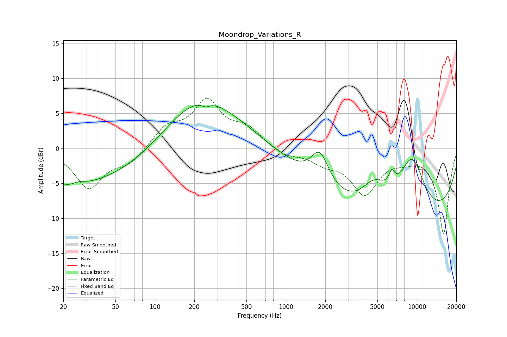

# Moondrop_Variations_R
See [usage instructions](https://github.com/jaakkopasanen/AutoEq#usage) for more options and info.

### Parametric EQs
Apply preamp of -6.3 dB when using parametric equalizer.

|   # | Type    |   Fc (Hz) |    Q |   Gain (dB) |
|-----|---------|-----------|------|-------------|
|   1 | Peaking |        27 | 3.64 |         0.3 |
|   2 | Peaking |        28 | 0.18 |        -5.8 |
|   3 | Peaking |        99 | 0.72 |        -0.4 |
|   4 | Peaking |       208 | 0.43 |         8.9 |
|   5 | Peaking |       244 | 5    |        -0.6 |
|   6 | Peaking |      1818 | 2.04 |         4.8 |
|   7 | Peaking |      4709 | 1.4  |         4   |
|   8 | Peaking |      6442 | 5.76 |         1.9 |
|   9 | Peaking |      7803 | 0.18 |       -11.5 |
|  10 | Peaking |      9159 | 1.18 |         9.1 |

### Fixed Band EQs
When using fixed band (also called graphic) equalizer, apply preamp of **-7.2 dB** (if available) and set gains manually with these parameters.

|   # | Type    |   Fc (Hz) |    Q |   Gain (dB) |
|-----|---------|-----------|------|-------------|
|   1 | Peaking |        31 | 1.41 |        -5.5 |
|   2 | Peaking |        62 | 1.41 |        -2   |
|   3 | Peaking |       125 | 1.41 |         2.8 |
|   4 | Peaking |       250 | 1.41 |         6.3 |
|   5 | Peaking |       500 | 1.41 |         2.5 |
|   6 | Peaking |      1000 | 1.41 |        -1.1 |
|   7 | Peaking |      2000 | 1.41 |        -1.7 |
|   8 | Peaking |      4000 | 1.41 |        -6.2 |
|   9 | Peaking |      8000 | 1.41 |        -1   |
|  10 | Peaking |     16000 | 1.41 |       -12.2 |

### Graphs

