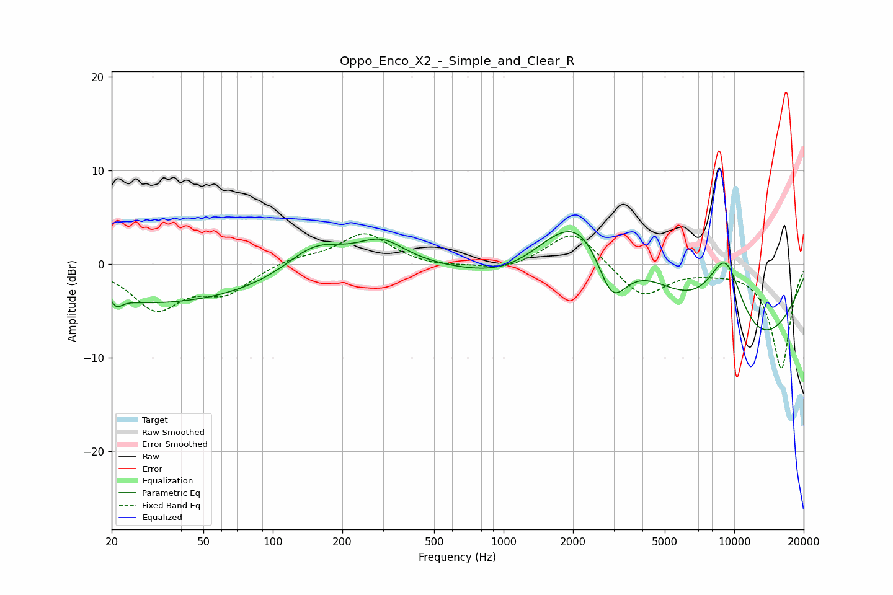

# Oppo_Enco_X2_-_Simple_and_Clear_R
See [usage instructions](https://github.com/jaakkopasanen/AutoEq#usage) for more options and info.

### Parametric EQs
Apply preamp of -3.5 dB when using parametric equalizer.

|   # | Type    |   Fc (Hz) |    Q |   Gain (dB) |
|-----|---------|-----------|------|-------------|
|   1 | Peaking |        20 | 3.67 |         3.2 |
|   2 | Peaking |        21 | 4.63 |        -3.3 |
|   3 | Peaking |        29 | 0.25 |        -4.3 |
|   4 | Peaking |       152 | 1.12 |         3   |
|   5 | Peaking |       295 | 1.36 |         2.6 |
|   6 | Peaking |      1138 | 0.63 |        -4.7 |
|   7 | Peaking |      2261 | 0.58 |        11.3 |
|   8 | Peaking |      2941 | 1.85 |        -7.7 |
|   9 | Peaking |      9179 | 1.28 |        11.3 |
|  10 | Peaking |     10000 | 0.38 |       -12.8 |

### Fixed Band EQs
When using fixed band (also called graphic) equalizer, apply preamp of **-3.3 dB** (if available) and set gains manually with these parameters.

|   # | Type    |   Fc (Hz) |    Q |   Gain (dB) |
|-----|---------|-----------|------|-------------|
|   1 | Peaking |        31 | 1.41 |        -4.6 |
|   2 | Peaking |        62 | 1.41 |        -2.8 |
|   3 | Peaking |       125 | 1.41 |         0.7 |
|   4 | Peaking |       250 | 1.41 |         3.3 |
|   5 | Peaking |       500 | 1.41 |        -0.4 |
|   6 | Peaking |      1000 | 1.41 |        -0.8 |
|   7 | Peaking |      2000 | 1.41 |         3.8 |
|   8 | Peaking |      4000 | 1.41 |        -3.6 |
|   9 | Peaking |      8000 | 1.41 |        -0.4 |
|  10 | Peaking |     16000 | 1.41 |       -11.2 |

### Graphs

