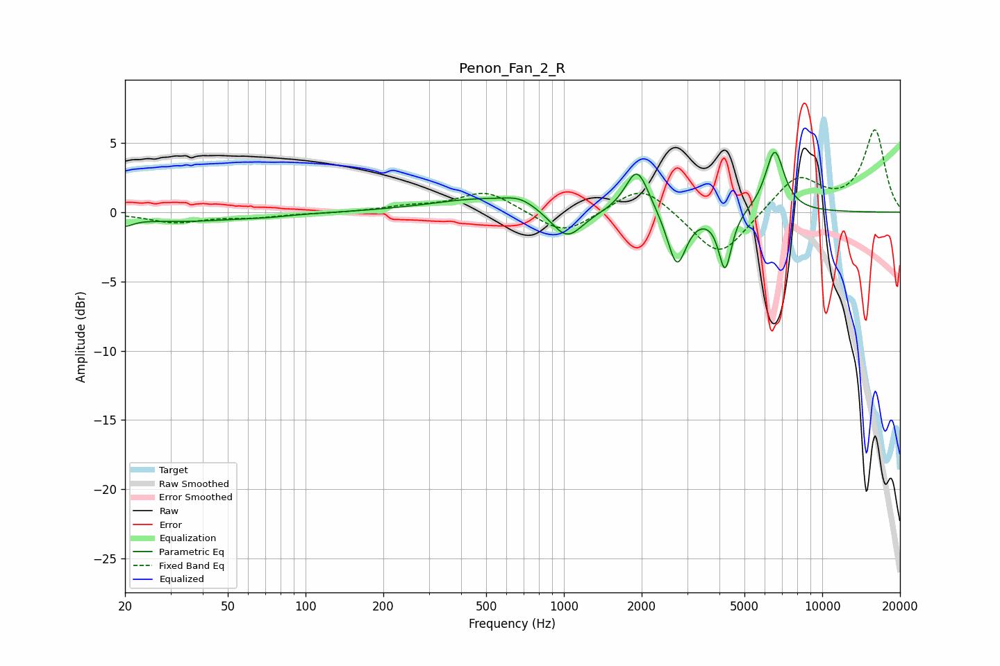

# Penon_Fan_2_R
See [usage instructions](https://github.com/jaakkopasanen/AutoEq#usage) for more options and info.

### Parametric EQs
Apply preamp of -4.4 dB when using parametric equalizer.

|   # | Type    |   Fc (Hz) |    Q |   Gain (dB) |
|-----|---------|-----------|------|-------------|
|   1 | Peaking |        20 | 4.53 |        -0.5 |
|   2 | Peaking |        34 | 0.56 |        -0.6 |
|   3 | Peaking |        72 | 2.03 |        -0.1 |
|   4 | Peaking |       484 | 0.71 |         1   |
|   5 | Peaking |       678 | 2.35 |         0.6 |
|   6 | Peaking |      1028 | 2.26 |        -2.2 |
|   7 | Peaking |      1920 | 3.14 |         3.3 |
|   8 | Peaking |      2737 | 3.89 |        -4   |
|   9 | Peaking |      4207 | 5.61 |        -4.2 |
|  10 | Peaking |      6546 | 3.69 |         4.5 |

### Fixed Band EQs
When using fixed band (also called graphic) equalizer, apply preamp of **-6.0 dB** (if available) and set gains manually with these parameters.

|   # | Type    |   Fc (Hz) |    Q |   Gain (dB) |
|-----|---------|-----------|------|-------------|
|   1 | Peaking |        31 | 1.41 |        -0.7 |
|   2 | Peaking |        62 | 1.41 |        -0.3 |
|   3 | Peaking |       125 | 1.41 |        -0.1 |
|   4 | Peaking |       250 | 1.41 |         0.3 |
|   5 | Peaking |       500 | 1.41 |         1.5 |
|   6 | Peaking |      1000 | 1.41 |        -1.7 |
|   7 | Peaking |      2000 | 1.41 |         2.1 |
|   8 | Peaking |      4000 | 1.41 |        -3.4 |
|   9 | Peaking |      8000 | 1.41 |         2.6 |
|  10 | Peaking |     16000 | 1.41 |         5.9 |

### Graphs

