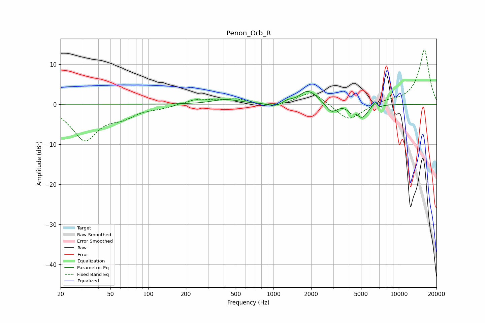

# Penon_Orb_R
See [usage instructions](https://github.com/jaakkopasanen/AutoEq#usage) for more options and info.

### Parametric EQs
Apply preamp of -3.3 dB when using parametric equalizer.

|   # | Type    |   Fc (Hz) |    Q |   Gain (dB) |
|-----|---------|-----------|------|-------------|
|   1 | Peaking |       417 | 1.39 |         1.2 |
|   2 | Peaking |      1045 | 2.55 |        -0.9 |
|   3 | Peaking |      1296 | 3.54 |         0.6 |
|   4 | Peaking |      1787 | 4.15 |         0.5 |
|   5 | Peaking |      1944 | 1.89 |         3.1 |
|   6 | Peaking |      2896 | 3.23 |        -2.4 |
|   7 | Peaking |      4154 | 6    |        -1.2 |
|   8 | Peaking |      5092 | 3.09 |        -3.2 |
|   9 | Peaking |      6560 | 5.93 |         2   |
|  10 | Peaking |      6884 | 6    |        -1.2 |

### Fixed Band EQs
When using fixed band (also called graphic) equalizer, apply preamp of **-13.6 dB** (if available) and set gains manually with these parameters.

|   # | Type    |   Fc (Hz) |    Q |   Gain (dB) |
|-----|---------|-----------|------|-------------|
|   1 | Peaking |        31 | 1.41 |        -8.7 |
|   2 | Peaking |        62 | 1.41 |        -2.4 |
|   3 | Peaking |       125 | 1.41 |        -0.7 |
|   4 | Peaking |       250 | 1.41 |         1.3 |
|   5 | Peaking |       500 | 1.41 |         1.2 |
|   6 | Peaking |      1000 | 1.41 |        -0.9 |
|   7 | Peaking |      2000 | 1.41 |         3.4 |
|   8 | Peaking |      4000 | 1.41 |        -4.3 |
|   9 | Peaking |      8000 | 1.41 |         0.7 |
|  10 | Peaking |     16000 | 1.41 |        13.7 |

### Graphs

