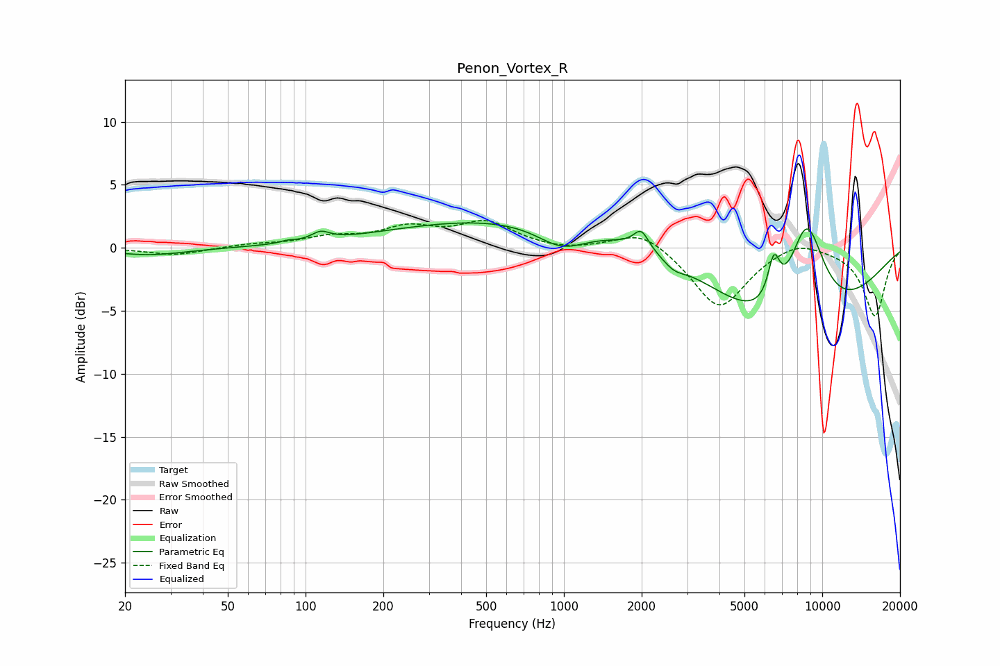

# Penon_Vortex_R
See [usage instructions](https://github.com/jaakkopasanen/AutoEq#usage) for more options and info.

### Parametric EQs
Apply preamp of -2.1 dB when using parametric equalizer.

|   # | Type    |   Fc (Hz) |    Q |   Gain (dB) |
|-----|---------|-----------|------|-------------|
|   1 | Peaking |        25 | 0.99 |        -0.6 |
|   2 | Peaking |        85 | 5.28 |         0.2 |
|   3 | Peaking |       114 | 4.02 |         0.7 |
|   4 | Peaking |       943 | 0.21 |         2.7 |
|   5 | Peaking |       984 | 1.41 |        -1.9 |
|   6 | Peaking |      1991 | 4.86 |         1.5 |
|   7 | Peaking |      2665 | 3.27 |        -0.7 |
|   8 | Peaking |      6496 | 5.83 |         3.3 |
|   9 | Peaking |      7565 | 0.46 |        -9   |
|  10 | Peaking |      8695 | 1.61 |         9.6 |

### Fixed Band EQs
When using fixed band (also called graphic) equalizer, apply preamp of **-2.3 dB** (if available) and set gains manually with these parameters.

|   # | Type    |   Fc (Hz) |    Q |   Gain (dB) |
|-----|---------|-----------|------|-------------|
|   1 | Peaking |        31 | 1.41 |        -0.6 |
|   2 | Peaking |        62 | 1.41 |         0.3 |
|   3 | Peaking |       125 | 1.41 |         0.7 |
|   4 | Peaking |       250 | 1.41 |         1.4 |
|   5 | Peaking |       500 | 1.41 |         1.9 |
|   6 | Peaking |      1000 | 1.41 |        -0.3 |
|   7 | Peaking |      2000 | 1.41 |         1.5 |
|   8 | Peaking |      4000 | 1.41 |        -4.9 |
|   9 | Peaking |      8000 | 1.41 |         0.9 |
|  10 | Peaking |     16000 | 1.41 |        -5.4 |

### Graphs

