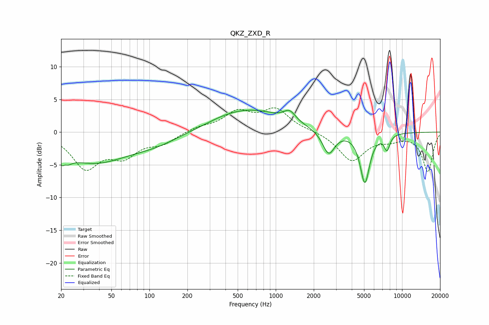

# QKZ_ZXD_R
See [usage instructions](https://github.com/jaakkopasanen/AutoEq#usage) for more options and info.

### Parametric EQs
Apply preamp of -3.5 dB when using parametric equalizer.

|   # | Type    |   Fc (Hz) |    Q |   Gain (dB) |
|-----|---------|-----------|------|-------------|
|   1 | Peaking |        21 | 4.47 |        -4.9 |
|   2 | Peaking |        21 | 5.96 |         3.2 |
|   3 | Peaking |        36 | 0.51 |        -4.5 |
|   4 | Peaking |       113 | 0.74 |        -1.3 |
|   5 | Peaking |       380 | 1.15 |         0.2 |
|   6 | Peaking |       621 | 0.53 |         3.4 |
|   7 | Peaking |      1288 | 2.97 |         1.6 |
|   8 | Peaking |      2623 | 2.93 |        -3.6 |
|   9 | Peaking |      5078 | 3.7  |        -7.7 |
|  10 | Peaking |      7600 | 5.99 |        -2.3 |

### Fixed Band EQs
When using fixed band (also called graphic) equalizer, apply preamp of **-3.8 dB** (if available) and set gains manually with these parameters.

|   # | Type    |   Fc (Hz) |    Q |   Gain (dB) |
|-----|---------|-----------|------|-------------|
|   1 | Peaking |        31 | 1.41 |        -5.2 |
|   2 | Peaking |        62 | 1.41 |        -3.2 |
|   3 | Peaking |       125 | 1.41 |        -1.5 |
|   4 | Peaking |       250 | 1.41 |         0.7 |
|   5 | Peaking |       500 | 1.41 |         2.8 |
|   6 | Peaking |      1000 | 1.41 |         3.3 |
|   7 | Peaking |      2000 | 1.41 |         0.2 |
|   8 | Peaking |      4000 | 1.41 |        -4.3 |
|   9 | Peaking |      8000 | 1.41 |        -0.9 |
|  10 | Peaking |     16000 | 1.41 |        -6   |

### Graphs

