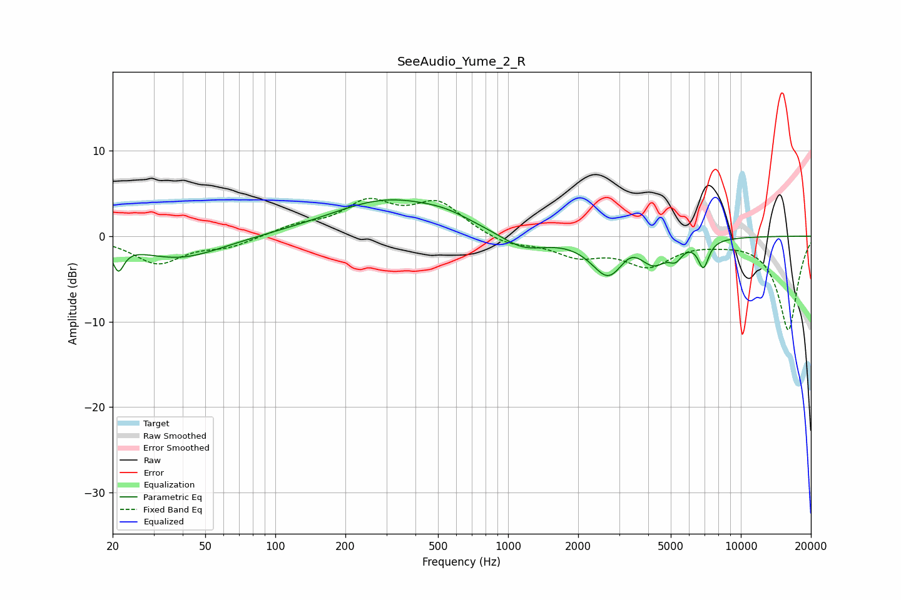

# SeeAudio_Yume_2_R
See [usage instructions](https://github.com/jaakkopasanen/AutoEq#usage) for more options and info.

### Parametric EQs
Apply preamp of -4.3 dB when using parametric equalizer.

|   # | Type    |   Fc (Hz) |    Q |   Gain (dB) |
|-----|---------|-----------|------|-------------|
|   1 | Peaking |        21 | 5.97 |        -2.8 |
|   2 | Peaking |        39 | 0.77 |        -2.6 |
|   3 | Peaking |       305 | 0.57 |         4.2 |
|   4 | Peaking |       541 | 1.37 |         0.7 |
|   5 | Peaking |      1161 | 1.42 |        -1.9 |
|   6 | Peaking |      2703 | 1.94 |        -4.6 |
|   7 | Peaking |      3345 | 2.65 |         1.3 |
|   8 | Peaking |      4222 | 2.4  |        -2.6 |
|   9 | Peaking |      5244 | 5.02 |        -1.4 |
|  10 | Peaking |      6906 | 5.99 |        -3.1 |

### Fixed Band EQs
When using fixed band (also called graphic) equalizer, apply preamp of **-4.5 dB** (if available) and set gains manually with these parameters.

|   # | Type    |   Fc (Hz) |    Q |   Gain (dB) |
|-----|---------|-----------|------|-------------|
|   1 | Peaking |        31 | 1.41 |        -3.1 |
|   2 | Peaking |        62 | 1.41 |        -1.1 |
|   3 | Peaking |       125 | 1.41 |         1.1 |
|   4 | Peaking |       250 | 1.41 |         3.6 |
|   5 | Peaking |       500 | 1.41 |         3.7 |
|   6 | Peaking |      1000 | 1.41 |        -1.1 |
|   7 | Peaking |      2000 | 1.41 |        -2.1 |
|   8 | Peaking |      4000 | 1.41 |        -3.2 |
|   9 | Peaking |      8000 | 1.41 |        -0.4 |
|  10 | Peaking |     16000 | 1.41 |       -11   |

### Graphs

